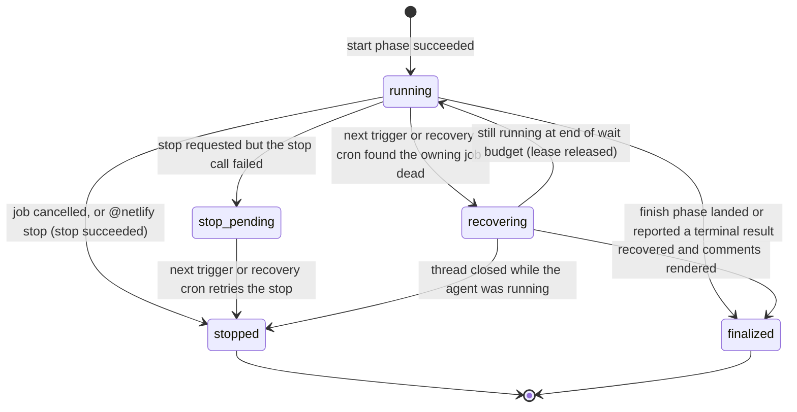

# Scope Guard, Run Recovery, Releases, and Ask Mode Plan

Status: spec (decisions from the 2026-09-25 interview are applied; see "Resolved Decisions")
Scope: four workstreams: (A) flag agent changes to protected or unexpected files, (B) durable run checkpoints and recovery of orphaned runs, (C) versioned releases with a moving `v1` tag, (D) an `ask` mode for questions that need no PR
Primary repo: `netlify-labs/agent-runner-action`
Consumers used for live verification: `netlify-labs/agent-runner-action-canary`, `netlify-labs/gtm-services`
Baseline: `main` at `10859ef` (SDK `nax-agent-runner-sdk@0.3.0`, agent/model/effort selection with OpenCode, runtime staged in `$RUNNER_TEMP`, crash-safe outcome reporting)

## Purpose

The action now reliably starts runs with the requested agent, model, and effort. The weak points have moved to what happens **around** a run:

1. **Agents change files nobody asked for.** Both live model tests in `gtm-services` (Fable 5, PR #54; Kimi K3, PR #56) went beyond a one-line task. They added deploy workarounds (`netlify.toml`, `redwood.toml`, `netlify/publish/index.html`), edited `AGENTS.md`, and created `pnpm-lock.yaml.txt`. Nothing in the result comment pointed this out. A reviewer who trusts "the agent did the task" could merge deploy-configuration changes by accident.
2. **Runs whose GitHub job dies are lost.** If the workflow job is cancelled, times out at the job level, loses its runner, or crashes after the agent starts, the Agent Runner keeps working on Netlify. Nothing lands its PR, and the status comment stays at "manifesting" indefinitely. For a *new* run the situation is worse: the runner ID is written to the status comment only at the very end of the job, so nothing durable even records which runner was started.
3. **Consumers can't pin a version.** The README and templates say `uses: netlify-labs/agent-runner-action@v1`, but the repo has no tags at all, so that reference fails to resolve. Every consumer pins a commit SHA by hand (`gtm-services` was bumped manually three times in one day).
4. **Questions need a PR.** Asking "how does the retry logic in `context-service` work?" today starts a normal run that may modify files and open a PR. The SDK already supports `mode: 'ask'`, but the action never uses it.

This plan covers all four, in an order that ships value early and keeps each PR independently reviewable and revertable.

## Current Ground Truth

All facts below were verified against `main` at `10859ef` and the published SDK `0.3.0`.

### Action pipeline (`action.yml`)

Composite steps, in order (abridged): `Check trigger` → `Install action dependencies` (id `install-deps`; stages `src/` + `package*.json` in `$RUNNER_TEMP/netlify-agent-runner-action`, runs `npm ci`, outputs `action-dir`) → `Acknowledge trigger` → `Get context information` (id `context-info`) → `Check trigger text size` → `Run preflight checks` → `Resolve bot identity` → `Find existing status comment` (id `find_comment`, filtered by `comment-author: <bot login>` and body `<!-- netlify-agent-run-status -->`) → `Find existing history comment` → `Extract existing agent run ID` (id `extract-agent-id`) → `Post preflight status comment` → `Fail on preflight failure` → `Check linked PR` → `Redirect to PR if issue has linked PR` → `Create initial status comment` (id `create_comment`) → `Create initial history comment` → `Checkout repository` → `Fetch base branch` → `Detect project type` → `Setup Bun` → `Cache Netlify CLI` → `Install Netlify CLI` → `Resolve Netlify site name` → `Update status to in-progress` → `Run Netlify Agent Runners` (id `netlify-agent`) → `Finalize Agent Runner pull request metadata` → `Manage labels` → `Generate success comment` / `Generate error comment` → `Post result comment` → `Generate status comment` → `Post or update status comment` → `Generate history comment` → `Post or update history comment` → `Cross-post to PR and update issue` → `Fallback status update` → `Update reaction on completion` → `Write GitHub step summary` → `Execution summary`.

Key conditions:

- `Update status to in-progress` runs only when `steps.extract-agent-id.outputs.agent-runner-id != ''`, meaning **only for follow-ups**. For a new run, the in-progress comment never gets a runner link or a `<!-- netlify-agent-runner-id:… -->` marker until the final status update.
- `Run Netlify Agent Runners` is one `node "$ACTION_DIR/src/run-agent.js"` process that starts (or follows up), waits, lands, and writes all outputs. A bash wrapper records `outcome=failure` if the script exits non-zero without reporting an outcome.
- `Manage labels` (opt-in `manage-labels: 'true'`) creates and applies `netlify-agent`, plus `security-fix` / `performance` keyword labels.

### `src/run-agent.js`

- `runAgentAction()` calls `sdk.start(...)` for new runs or `createLegacyHandle()` + `sdk.followUp(...)` for follow-ups, then `sdk.waitFor(handle)`, then `sdk.land(handle)` when `result.changes === 'changed'` and not dry-run.
- `saveHandleCheckpoint()` serializes the handle to `$RUNNER_TEMP/agent-runner-sdk-handle-<runnerId>.json` (mode `0600`) after start and after landing, and through the SDK `onLandingCheckpoint` hook. **`RUNNER_TEMP` is destroyed when the job ends**, so these checkpoints never outlive the job.
- `createLegacyHandle()` already rebuilds a valid SDK handle from only a runner ID, the site ID, and the listed sessions. It uses a placeholder prompt (`'Resume a pre-SDK agent-runner-action run.'`) and validates the result through `sdk.parseHandle`. This is the mechanism recovery will generalize.
- Result data available after `waitFor`: `RunResult` (SDK `dist/result.d.ts`) has `status`, `runnerId`, `sessionId`, `resultText`, `usage`, `changes: 'changed' | 'unchanged' | 'unknown'`, **`diff?: { kind: 'inline', text } | { kind: 'url', url }`**, `deployUrl`, and `links`. The diff is the **current session's** change set, not the PR's cumulative diff.

### SDK durable handles (`nax-agent-runner-sdk@0.3.0` README, "Durable handles and deadlines")

- Handles are version-stamped (`v: 1`) and contain **the original effective input (including the full prompt)**, `siteId`, `currentSessionId`, `policy` (`landing`, absolute `deadlineAt`, retry budget), retry progress, prompt-delivery metadata, and landing checkpoints (`prUrl`, `committedSessionIds`, …). `SessionHandle` adds `sessionId` and `sessionInput`.
- "`waitFor` enforces [`deadlineAt`] in-process. Out-of-band workers must compare the current time to `deadlineAt` and call `stop`."
- `getSnapshot(handle)` returns a non-blocking snapshot; `land(handle)` "creates or resumes a pull request"; landing failures are returned as data.
- Sessions echo `mode` (live sessions show `"mode": "normal"`), and `RunnerMode = 'normal' | 'create' | 'ask'` is accepted on both `start` and `followUp`. **The backend semantics of `ask` are not documented anywhere we have found** (not in the SDK README, NAX source, or NAX plans).
- Backend limitation recorded by NAX (2026-08-06): follow-up sessions accept `effort` but the session's `agent_config` does not echo it.

### Comment state (`src/comment-markers.js`)

- Markers: `<!-- netlify-agent-run-status -->`, `<!-- netlify-agent-run-history -->`, `<!-- netlify-agent-runner-id:… -->`, `<!-- netlify-agent-session-data:{json} -->`, `<!-- netlify-agent-run-result runnerId=… sessionId=… totalTokens=… -->`.
- `ALLOWED_MARKER_INNER` is an allowlist; `stripUntrustedHtmlComments()` removes any other HTML comment from user-influenced content before parsing, so outsiders cannot smuggle fake state.
- Session-data entries are sanitized per field (`pr_url`, `gh_action_url`, `screenshot` URL allowlists; `commit_sha` format; 2048-char cap).
- The status comment is found only among **bot-authored** comments, and the PR-body fallback is used only for same-repo PRs (see `extract-agent-id.js`). That is the trust anchor for durable state.

### Result and history comments

- `renderResultComment()` (`src/generate-result-comment.js`) writes the header `### [Run #N | <agent> | Agent Run completed](<agent run url>) ✅`, a usage line (tokens and credits already shown), the cleaned prompt, the result, links, and the result marker.
- The history TOC (`src/generate-history-toc.js`) parses that first line (`parseResultSummary`) to list runs. The per-run label is currently the **agent only**. Model and effort are not shown anywhere after the in-progress comment.

### Releases

- `git ls-remote --tags origin` returns nothing. `package.json` version is `1.0.0`.
- `.github/workflows/ci.yml` runs `bun test`, `docs:check`, and `tsc` on pushes to `main` and on PRs.
- `.github/workflows/canary.yml` triggers on `pull_request` (paths `action.yml`, `src/**`) and `workflow_dispatch` (inputs include `action_ref`). It is **not** callable with `workflow_call` today.
- Open bead `agent-runner-action-o70` "Release gate before moving @main or release tags" (P1) lists the required checks: tests, `tsc`, docs drift, no bead cycles, scenario harness, simulator sanity, and live example-repo smoke tests.

### Observed scope creep (evidence for Workstream A)

| Run | Model | Requested change | Files the PR actually touched |
|---|---|---|---|
| `gtm-services` #51 → PR #52 | codex (Auto), `low` | add `docs/agent-runner-smoke-test.md` | only that file |
| `gtm-services` #53 → PR #54 | claude `claude-fable-5`, `high` | add `docs/agent-runner-fable-smoke-test.md` | that file **plus** `netlify.toml`, `redwood.toml`, `netlify/publish/index.html` |
| `gtm-services` #55 → PR #56 | opencode `moonshotai/kimi-k3`, `max` | add `docs/agent-runner-kimi-smoke-test.md` | that file **plus** `AGENTS.md`, `netlify.toml`, `pnpm-lock.yaml.txt` |

The added files' own comments say why: the Agent Runners deploy ran `netlify deploy` from the monorepo root, the CLI stopped with "Projects detected: … Configure the project you want to work with", and the agent worked around it. The one-line Codex/Auto run did not (it took about 3 minutes, versus 11 to 15 for the others).

## Goals

1. Make every agent change to sensitive or unexpected files **visible in the result and status comments**, with optional label and draft escalation, without ever blocking a run by default.
2. Reduce scope creep at the source with a default scope instruction added to the agent prompt (teams can opt out).
3. Record a durable, secret-free checkpoint **as soon as a run starts**, so any later job can find and finish it.
4. Recover orphaned runs automatically: on the next `@netlify` comment in the same thread, and through an optional scheduled recovery workflow. Make stopping explicit: cancelling the workflow or commenting `@netlify stop` stops the agent.
5. Show the requested agent, model, and effort for every run in result and history comments, closing the backend's follow-up effort echo gap.
6. Publish immutable `vX.Y.Z` releases and a moving `v1` tag, gated on tests and a live canary, so `@v1` works and Dependabot can propose upgrades.
7. Support `ask` mode for questions: an answer in a comment, no commits, no PR.

## Non-Goals

- Blocking or reverting agent changes automatically. Workstream A reports and escalates; humans decide.
- Fixing the `gtm-services` monorepo deploy detection itself. That is a Netlify site-settings task, tracked separately. Workstream A only makes its side effects visible.
- Recovering `workflow_dispatch` runs that have no issue or PR. They have no status comment to hold a checkpoint. Their checkpoint still appears in the step summary for manual recovery.
- Queueing multiple pending prompts per thread. GitHub concurrency groups keep one running and one pending job per group; that existing limitation is out of scope (see Risks).
- GitHub Marketplace listing. It needs a manual UI step; the release workflow produces everything the listing needs.
- Arena-style multi-model runs.

## Design Principles

1. **Never block by default.** New checks add information to comments. Escalations (label, draft) are opt-in.
2. **No secrets, prompts, or site IDs in comments.** Durable state holds only identifiers and small enums. Some consumers treat `NETLIFY_SITE_ID` as a secret; GitHub does not mask secrets inside comment bodies the action writes through the API.
3. **Reuse the existing pipeline.** Recovery renders comments with the same `renderResultComment` / `renderStatusComment` / history functions. Ask mode reuses start, wait, and comments, and only skips landing.
4. **Bot-authored state only.** New markers follow the existing allowlist and bot-author trust model.
5. **Backward compatible within v1.** Existing comments without new markers behave exactly as today. New inputs default to current behavior.
6. **Every inline shell step has a test that executes it**, following `src/action-steps.test.js`.
7. **Verify live before calling it done.** Every workstream ends with a canary scenario and, where relevant, a `gtm-services` smoke test.

---

## Workstream A: Scope Guard

### User problem

A reviewer sees "✅ Agent Run completed" and a PR titled after the task. Nothing says "this PR also changes your deploy configuration and your agent instructions." In both observed cases the extra files were plausible-looking and easy to miss in a long diff.

### What the user sees

Result comment, after the result summary (only when something matched):

```markdown
#### ⚠️ Review these changes

This run changed files that usually need a closer look:

| File | Why it's flagged |
|---|---|
| `netlify.toml` | Protected path `**/netlify.toml` |
| `redwood.toml` | Protected path `*.toml` |
| `netlify/` (new folder) | New top-level folder |
| `pnpm-lock.yaml.txt` (new file) | New file at the repository root |

These may be unrelated to the request. Configure this check with `protected-paths`.
```

The status comment adds one line under the run line: `⚠️ 4 files outside the usual scope. See the result comment.`

**Where it appears:** wherever the run posts its result comment, **and on the PR**. When a run was triggered from an issue, the reviewer works on the PR, so the action also posts the same section as a comment on the PR the run opened or updated. When the run was triggered on the PR itself, the result comment already lives there and no second comment is posted.

**Files the request asked for aren't warnings.** If the user's prompt names a flagged file's path or basename (for example "fix the redirect in `netlify.toml`" or "add a CI job in `.github/workflows`"), that file moves to a separate "Requested" line instead of the warning table. For a folder pattern, naming the folder counts (`.github/workflows` covers `.github/workflows/ci.yml`).

With `protected-paths-action: label` the PR (or the issue, for dry runs) also gets the `netlify-agent:review-scope` label. With `draft`, an open PR created by this run is converted to a draft.

**Flags are comments only.** There is no GitHub check or commit status, so they never affect branch protection. Repos that want enforcement use CODEOWNERS on the same paths.

### Inputs

| Input | Default | Meaning |
|---|---|---|
| `protected-paths` | built-in list (below) | Newline- or comma-separated glob patterns. `default` expands to the built-in list, so users can add to it (`default, infra/**`). `none` disables pattern checks. A leading `!` excludes a match (later patterns win). |
| `flag-new-top-level` | `'true'` | Report files added at the repository root and new top-level folders. |
| `protected-paths-action` | `'comment'` | Comma list of `comment`, `label`, `draft`. `comment` is always implied while any check is enabled. |
| `scope-instructions` | `'default'` | Text appended to the agent prompt (see below). `default` uses the built-in text; any other value replaces it; an empty string (`''`) disables it. |

New outputs: `scope-flags` (JSON array of `{ path, reason, rule }`), `scope-flag-count`.

### Built-in protected list and why

| Pattern | Why |
|---|---|
| `.github/**` | Workflows run with repository secrets. Workflow edits are a security-sensitive change. |
| `**/netlify.toml` | Build and deploy configuration (observed: Fable and Kimi). |
| `*.toml` | Root-level tool configuration such as `redwood.toml` (observed: Fable). Root only, so `packages/x/pyproject.toml` isn't flagged. |
| `**/package-lock.json`, `**/pnpm-lock.yaml`, `**/yarn.lock`, `**/bun.lock`, `**/bun.lockb` | Lockfile churn is rarely part of a small request and hides dependency changes. |
| `**/pnpm-workspace.yaml` | Changes the workspace graph. |
| `AGENTS.md`, `CLAUDE.md`, `**/AGENTS.md` | Changes how future agents behave in this repo (observed: Kimi). |
| `**/.env*` | Likely secrets. |

The new-top-level check catches the two observed files no pattern would: `netlify/publish/index.html` (new top-level folder `netlify/`) and `pnpm-lock.yaml.txt` (new root file).

### Glob semantics (`src/path-globs.js`, new)

Zero-dependency matcher on repo-relative POSIX paths:

- `**` matches any sequence including `/`; `**/` at the start also matches zero directories (so `**/netlify.toml` matches `netlify.toml`).
- `*` matches any sequence **not** containing `/`; `?` matches one non-`/` character; `{a,b}` alternation.
- A pattern without `/` matches **only at the root** (`*.toml`, `AGENTS.md`). This is deliberately stricter than `.gitignore`, where a slash-less pattern matches at any depth. Explicit `**/` keeps the list readable and avoids surprises. Document this prominently.
- `!pattern` negates. Evaluation is in order, and the last matching pattern decides.
- Case-sensitive, like git.

### Where the changed-file list comes from

In priority order:

1. **The session diff** (`RunResult.diff`, `kind: 'inline'`). Parse `diff --git a/<old> b/<new>` headers plus `new file mode` / `deleted file mode` / `rename from`/`rename to` lines. This gives exactly the files *this run* changed, including in dry runs where no commit exists.
2. **`kind: 'url'` diffs** (large diffs): skip fetching the URL, which may need auth and be large, and fall through.
3. **After landing**, the landed commit: `GET /repos/{o}/{r}/commits/{commitSha}` → `files[].filename` / `status` / `previous_filename` (commit SHA from `currentSession.commitSha`).
4. If none is available, report "Couldn't determine which files this run changed" in the step summary only. Don't post a warning without evidence.

Parser edge cases, each with a unit test: quoted paths with spaces or non-ASCII (`diff --git "a/my file" "b/my file"`), renames (flag the new path and mention the old), deletions (flag protected deletions too), binary files, mode-only changes, and `/dev/null` sides.

New-top-level detection:

- **Root files:** added files (`new file mode` or status `added`) whose path has no `/`.
- **Top-level folders:** for each distinct first path segment among added files, check whether it exists on the base ref: `GET /repos/{o}/{r}/contents/{segment}?ref={base}`, where 404 means new. At most 10 lookups per run. Beyond that, report "and N more new top-level entries" without checking.

### Pipeline placement

- `src/scope-guard.js` (new, pure): `collectChangedFiles({ diffText, commitFiles })`, `evaluateScope({ files, patterns, baseTopLevel })`, and `renderScopeSection(flags)`, which escapes paths for Markdown, caps the list at 20 rows plus "and N more", and never renders HTML comments.
- `run-agent.js` (finish phase, after landing or after wait in dry run): compute the changed files and write `scope-flags` / `scope-flag-count` outputs, plus `$RUNNER_TEMP/agent-scope-<runnerId>.json` for renderers. It does *not* need GitHub API access for the inline-diff path.
- New step **`Check run scope`** (github-script, after `Run Netlify Agent Runners`, `continue-on-error: true`): performs the commit-files fallback and top-level lookups (it has the GitHub client), finalizes the flags, and applies `label` / `draft` actions.
  - `draft` uses GraphQL `convertPullRequestToDraft`. It is applied only when this run *created* the PR (`landing.kind === 'prOpen'` and there was no prior runner PR), never to a PR a human already moved out of draft.
- `renderResultComment` and `renderStatusComment` read the flags file or env and add the section and the one-liner.

### Scope instructions

By default (`scope-instructions: default`), `run-agent.js` appends a delimited block to the prompt sent to the SDK:

```text
<prompt>

---
Scope guidance from this repository's workflow:
Only modify files needed for this task. If a build or deploy fails for reasons unrelated to your task, do not change build, deploy, or workspace configuration to work around it; finish the task and describe the failure in your result.
```

This is on by default because both observed scope-creep runs added workaround files after a deploy failure unrelated to their task. Under the versioning policy (Workstream C), additions to agent guidance are a minor behavior change, announced under "Behavior changes" in the release notes.

- The block is appended **after** the trigger-size check. Its size counts toward the SDK prompt limit (`NAX_SAFE_PROMPT_BYTES`, default 16 KiB with blob fallback), so `Check trigger text size` must include the configured instruction length.
- Display strips the block. `utils.cleanPrompt` removes the exact delimited block (matched on the fixed header line) so comments show only what the user wrote. The result comment renders prompts from `latestSession.prompt`, which will include the block, so this stripping is required.
- Repos opt out with `scope-instructions: ''`.

### Tests (Workstream A)

- `path-globs.test.js`: table tests for every operator, root-only semantics, negation order, case sensitivity, and each built-in pattern against positive and negative paths.
- `scope-guard.test.js`:
  - diff parsing fixtures, one per edge case above
  - **reconstructed fixtures from PR #54 and PR #56** (their file lists), asserting exactly the flags shown in the UX example
  - PR #52's file list, asserting no flags
- Rendering: escaping of hostile file names (backticks, `|`, `<!--`, `[x](y)`), the 20-row cap, and the status one-liner.
- `action-steps.test.js`: the `Check run scope` step is gated correctly and `continue-on-error`.
- Prompt: the scope block is appended by default, omitted with `scope-instructions: ''`, replaced by custom text, stripped from every display path (status, result, history, PR title cleanup), and counted in the size check.
- "Requested" suppression: a path or basename named in the prompt moves to "Requested"; a named folder covers files beneath it; mentions inside code spans still count (users often write `` `netlify.toml` ``); substring accidents don't count (`toml` alone doesn't suppress `netlify.toml`).
- PR placement: an issue-triggered run posts the section on the PR too; a PR-triggered run posts it once.
- **Live:** canary scenario "scope creep". The canary prompt asks for the marker line *and* an edit to `netlify.toml` in the canary repo. The controller asserts that the result comment contains the scope section naming `netlify.toml`.

---

## Workstream B: Run Checkpoints and Recovery

### Failure modes this fixes

| Failure | Today | After |
|---|---|---|
| Job cancelled while the agent runs | Agent keeps running; comment stuck at "manifesting"; for new runs nothing records the runner | **Cancel means stop:** a cancel step stops the agent and marks the run stopped |
| Job-level `timeout-minutes` shorter than the agent's time limit plus setup | GitHub cancels the job at its timeout; same as above | Preflight detects the mismatch, warns, and shortens the agent's limit to fit, so the agent's own timeout fires first and reports cleanly |
| Runner machine lost, or crash after `sdk.start` | Same; the crash wrapper now reports failure, but the work is still lost | Recovered by the next `@netlify` comment or the optional recovery cron |
| No way to stop a run from the thread | Only by cancelling the workflow, which didn't stop the agent | `@netlify stop` |
| Follow-up effort not echoed by the backend | History shows only the agent | Requested agent/model/effort recorded per session |

### Why not store the raw SDK handle

The handle contains the full original prompt (possibly large, possibly a blob reference), the `siteId`, and prompt-delivery metadata. Writing it to a comment would publish the prompt again (bad for private context pasted into issues, and it can exceed GitHub's 65,536-character comment limit). It would also publish the site ID, which some consumers keep as a secret. `createLegacyHandle()` already proves a valid handle can be rebuilt from identifiers alone. So we persist a **checkpoint**, not a handle.

### Checkpoint marker

`<!-- netlify-agent-run-checkpoint:{json} -->`, stored in the **status comment** (bot-authored, mutable, already the source of truth for `runner-id`).

```jsonc
{
  "v": 1,
  "state": "running",            // running | stop-pending | recovering | finalized | stopped
  "runnerId": "6ab5de0c…",       // RUNNER_ID_FORMAT
  "sessionId": "6ab5de0c…",      // current session (== handle.currentSessionId)
  "kind": "run",                 // run (new runner) | session (follow-up)
  "agent": "opencode",           // catalog provider
  "model": "moonshotai/kimi-k3", // optional, MODEL_ID_PATTERN
  "effort": "max",               // optional, EFFORT_WORDS (wire value)
  "mode": "normal",              // normal | ask
  "landing": "pr",               // pr | none (dry run / ask)
  "deadlineAt": 1790000000000,   // handle.policy.deadlineAt (ms epoch)
  "startedAt": 1789998500000,
  "ghRunId": 36086874799,        // workflow run that owns it
  "ghRunAttempt": 1,
  "requester": "DavidWells",     // GitHub login that triggered the run (for @-mention on recovery)
  "prHeadSha": "2a62981…",       // PR head when the session started (follow-ups on a PR); used to detect a moved branch
  "prUrl": "https://github.com/o/r/pull/56",   // once known; PR URL allowlist
  "lease": { "ghRunId": 36090000000, "until": 1790000300000 } // only while recovering
}
```

- The size stays under 1 KB. No prompt, no site ID, no tokens.
- `comment-markers.js` gains `renderCheckpointMarker()` / `parseCheckpoint()`. Parsing validates every field against the same formats used elsewhere (runner ID, model ID, effort words, PR URL allowlist, finite integers) and drops the whole checkpoint when `v` is unknown or any required field is invalid.
- `ALLOWED_MARKER_INNER` adds `run-checkpoint:`.
- `extract-agent-id.js` outputs `checkpoint` (the validated JSON) and `checkpoint-state`.

### Lifecycle



(`stop_pending` is written `stop-pending` in the marker.)

`finalized` and `stopped` are terminal. A later follow-up writes a **new** checkpoint for its new session; it never edits a terminal one back to `running`.

### Pipeline changes

1. **Split `run-agent.js` into two phases**, invoked as `node run-agent.js start` and `node run-agent.js finish`:
   - `start`: validate input, `sdk.start` / `sdk.followUp`, save the full handle to `$RUNNER_TEMP` (as today), and write outputs `agent-id`, `session-id`, and `checkpoint` (the JSON above with `state: running`). No waiting.
   - `finish`: load the handle file, then `waitFor` → landing → scope guard → outputs, exactly as today's second half.
   - With no argument, the script runs both phases (keeps `simulate.js`, tests, and any external callers working).
   - The crash-fallback wrapper applies to both steps. A `start` crash leaves no checkpoint, which is correct because no runner exists. A `finish` crash leaves the `running` checkpoint for recovery.
2. **New step `Record run checkpoint`** between the two phases (github-script, `continue-on-error: true`). It updates the status comment to the in-progress body **with** the agent-run link, the runner-ID marker, and the checkpoint marker.
   - This also fixes a visible gap: new runs finally show "View the in progress agent run" while running, not only follow-ups.
   - It replaces `Update status to in-progress` for new runs and merges with it for follow-ups (a single step either way).
3. **New step `Stop agent on cancel`** with `if: cancelled() && steps.run-start.outputs.checkpoint != ''`. **Cancelling the workflow means "stop this work".** The step calls `sdk.stop` on the checkpointed runner, sets `state: stopped`, and updates the status comment: "⏹ The workflow was cancelled, so the agent run was stopped." If the stop call fails, it writes `state: stop-pending`, and the next trigger or the recovery cron retries the stop. GitHub gives cancelled jobs a short grace period, so this step does one stop attempt and one comment update, nothing else.
   - GitHub also runs `cancelled()` steps when a job exceeds its own `timeout-minutes`, and the step can't reliably tell that apart from a human cancel. That's why preflight prevents the mismatch (next item) instead of guessing at cancel time.
4. **Preflight job-timeout check.** Preflight reads the running job's `timeout-minutes` from the workflow file at `github.sha` (path from `GITHUB_WORKFLOW_REF`, job from `GITHUB_JOB`, fetched with the contents API; the step runs before checkout). If the agent limit (`timeout-minutes` input) plus a 5-minute setup margin exceeds the job timeout, it warns (log annotation and step summary) and **shortens the agent's limit** to `job timeout − 5 minutes` for this run. If the file can't be read or the job has no explicit timeout (GitHub's default is 360 minutes), the check is skipped.
5. **Final status rendering** writes `state: finalized` (or keeps `stopped`) into the checkpoint marker, alongside the existing markers.

### Recovery engine (`src/recover-run.js`, new)

```js
recoverRun({ sdk, github, repo, issueNumber, statusComment, checkpoint, input, budgetMs, now })
  -> { outcome: 'finalized' | 'stopped' | 'still-running' | 'skipped', reason, sessionDataMap }
```

Steps:

1. **Handle reconstruction** (`buildResumeHandle(checkpoint, input)`, generalizing `createLegacyHandle`):
   - Fetch the runner and sessions. **Verify `runner.siteId === input.siteId`**; otherwise skip with reason `site-mismatch`. This defends against a tampered or copied checkpoint pointing at another site's runner.
   - Verify that the checkpoint session exists.
   - Build a `kind: 'run'` or `kind: 'session'` handle with a placeholder prompt, `policy.deadlineAt = checkpoint.deadlineAt`, `landing` from the checkpoint, and `landing.prUrl` from the checkpoint or `runner.prUrl`. Validate with `sdk.parseHandle`.
2. **Decide** from `sdk.getSnapshot(handle)`:

Checks first, in order:

- **Thread closed** (issue closed, or PR closed or merged): if the agent is still active, `sdk.stop`. Never land. Post a short result ("Stopped: this thread was closed before the run finished") → `stopped`.
- **`stop-pending`**: retry `sdk.stop` → `stopped`.

Then from the snapshot:

| Snapshot | Action |
|---|---|
| terminal succeeded, changes, not landed (`landing: pr`), PR head unchanged | `sdk.land(handle)` → render result/status/history → `finalized` |
| terminal succeeded, changes, not landed, **PR head moved** since `prHeadSha` (a human pushed) | don't land; render the result with "Not applied: the branch changed after this run started. See the agent run to apply it manually." → `finalized` |
| terminal succeeded, already landed or no changes | render comments only → `finalized` |
| terminal failed / cancelled | render failure comments → `finalized` |
| active | `sdk.waitFor` bounded by the recovering job's budget; then re-decide; if still active → release the lease → `still-running` |

**No separate recovery time limit.** Recovery never stops a run for being slow; an orphaned run is allowed to finish and land. The reconstructed handle's `deadlineAt` is set to the end of the recovering job's budget, not the original deadline, so `waitFor` returns in time for this job to exit cleanly. The run is simply checked again by the next trigger or cron.

3. **Rendering** reuses existing modules: write `agent-sessions-<runnerId>.json` exactly as `run-agent.js` does, then call `renderResultComment` (header gets a `· recovered` suffix, and the body starts with "@<requester>, your earlier request finished." so the requester gets a GitHub notification), `renderStatusComment`, and `renderHistoryTocFromComments`, and post or update them with the same markers.
4. **Idempotency.** A recovered session that already has a result comment (`parseResultCommentIdentifiers` finds its `sessionId`) never gets a second one. `sdk.land` is itself resumable.

### Recovery on the next trigger ("finish before follow")

When a new `@netlify` comment arrives and `checkpoint-state` is `running`, `stop-pending`, or `recovering` with an expired lease:

- Concurrency groups in the templates (`netlify-<repo>-<issue>`, `cancel-in-progress: false`) serialize jobs per thread. If a `running` checkpoint's `ghRunId` points to a completed workflow run (`GET /actions/runs/{id}`), the owner is dead. If that run is still in progress, the current job was queued behind it. That can't normally happen with a correct concurrency group, but it's handled: wait up to the budget, then proceed.
- A new step **`Recover unfinished run`** (github-script, requires the staged SDK via `ACTION_DIR`) runs `recoverRun` before the start phase.
- **Wait, then run the new request.** Recovery may use at most **40% of the effective agent time limit** (`timeout-minutes`, after any preflight shortening). The rest is reserved for the new request, so one job never needs more than its timeout.
- If recovery finalizes within that share, the new prompt continues as a normal follow-up on the same runner. That keeps the runner's context, and the SDK follow-up path lands onto the existing PR. The user sees the recovered result and then the new one.
- If the old session is still running when its share is used up, the job posts "The previous run is still working, so this request wasn't started. Comment again once it finishes." It then **does not** start the new prompt, because the backend rejects an active-session conflict anyway. Nothing queues the request, so the message must not promise it.
- Downstream steps must use the recovered `session-data-map` output (`steps.recover.outputs.session-data-map || steps.extract-agent-id.outputs.session-data-map`).

### Scheduled recovery (opt-in cron workflow)

What it is: an **optional second workflow file** that a repo adds next to its main one. GitHub starts it on a timer (`on: schedule`); it doesn't react to comments. Each time, it finds agent runs whose GitHub job died without finishing them and finishes them: it waits for the agent if needed, lands the PR, and updates the comments, as if the original job had finished normally. Without it, an orphaned run is picked up only when someone comments `@netlify` again on that thread.

Cost and caveats to document: a run with nothing to do takes about 20 to 30 seconds of Actions time (roughly 15 to 25 minutes a day at every 30 minutes). GitHub may delay scheduled runs under load and disables schedules in public repos after 60 days without activity.

A new action input `operation: 'trigger' | 'recover'` (default `trigger`). With `recover`, the composite runs a short path: install deps → `Sweep unfinished runs` → step summary. A new template `workflow-templates/netlify-agents-recover.yml`:

```yaml
on:
  schedule: [{ cron: '*/30 * * * *' }]
  workflow_dispatch:
concurrency: { group: netlify-agents-recover, cancel-in-progress: false }
permissions: { contents: read, issues: write, pull-requests: write, actions: read }
jobs:
  recover:
    runs-on: ubuntu-latest
    timeout-minutes: 30
    steps:
      - uses: netlify-labs/agent-runner-action@v1
        with:
          operation: recover
          netlify-auth-token: ${{ secrets.NETLIFY_AUTH_TOKEN }}
          netlify-site-id: ${{ secrets.NETLIFY_SITE_ID }}
```

Sweep algorithm (`src/sweep-runs.js`):

1. `GET /repos/{o}/{r}/issues?state=all&sort=updated&direction=desc&since=<now − recover-lookback-hours>` (includes PRs; default 48 hours), capped at `recover-max-items` (default 50). Closed items are included so their still-running agents can be stopped (see the thread-closed rule). The default is safe because `timeout-minutes` is capped at 24 hours (`MAX_TIMEOUT_MINUTES` in `run-agent.js`) and the checkpoint write itself updates the issue. So every unfinished run's thread was updated within its deadline plus one day.
2. For each item, find the bot's status comment (paginated comments filtered by bot login and status marker) and parse the checkpoint. Skip if absent, `finalized`, or `stopped`.
3. **Liveness:** `GET /actions/runs/{ghRunId}`. If the run is `queued`, `in_progress`, `waiting`, `requested`, or `pending`, skip it (still owned).
4. **Lease:** write `state: recovering` plus `lease: { ghRunId: <recovery-cron run>, until: now + 10 min }`, then re-read the comment. Proceed only if our lease is present, so a concurrent trigger job or a second cron run loses cleanly.
5. Run `recoverRun` with `budgetMs` = the cron job's remaining time divided by the remaining items (floor 2 minutes).
6. Write a summary table: item, runner, action taken, reason.

The trigger path honors a fresh lease the same way: if another job holds an unexpired lease, it waits up to 60 seconds for `finalized` and then proceeds without recovering.

### `@netlify stop`

A write-access user (the same `allowed-users` / collaborator rule as starting runs) comments `@netlify stop` on the thread:

1. The new workflow run reads the checkpoint from the thread's status comment.
2. It calls `sdk.stop` on that runner and sets `state: stopped`. It does **not** cancel the other GitHub workflow run.
3. The original job, still in `waitFor`, sees the run end as cancelled, finalizes the comments ("⏹ Stopped by @user"), and exits normally.
4. With no active run: reply "Nothing to stop: the last run already finished."

Parser: `stop` becomes a reserved command word, recognized only as the entire mention (`@netlify stop`, optionally followed by punctuation). `@netlify stop the cron job from firing twice` stays a normal build request. The catalog-integrity test adds `stop` to the reserved words.

**Concurrency caveat.** The templates put every run for a thread in one concurrency group (`netlify-<repo>-<issue>`, `cancel-in-progress: false`), so a stop run would queue behind the job it's trying to stop. The templates change so stop comments get their own group:

```yaml
concurrency:
  group: ${{ contains(github.event.comment.body, '@netlify stop') && format('netlify-stop-{0}', github.run_id) || format('netlify-{0}-{1}', github.repository, github.event.pull_request.number || github.event.issue.number || github.run_id) }}
  cancel-in-progress: false
```

Workflow files without this change degrade gracefully: the stop runs after the agent finishes and replies "Nothing to stop". Preflight detects a workflow file without the stop-aware group and reports "Workflow file updates available" in the log and step summary only, never in comments.

### Per-run agent, model, and effort

- Session-data entries gain `agent`, `model`, `effort`, and `mode` fields (sanitized: provider list, `MODEL_ID_PATTERN`, `EFFORT_WORDS`, mode enum), written from the resolved selection when each session starts.
- `renderResultComment` header becomes `### [Run #N | claude · Fable 5 · high | Agent Run completed](…)`. It prefers the session's `agent_config` when present and falls back to the session-data request, so follow-up effort appears even though the backend doesn't echo it.
- `parseResultSummary` keeps parsing old headers (agent only) and new headers. The TOC shows the full segment.

### Security review (Workstream B)

- Checkpoints are read only from bot-authored status comments (same as `runner-id`). Repo admins can edit any comment. That is within the existing trust model (admins already control the workflow and secrets).
- Tampering can at most point recovery or `@netlify stop` at a different runner. The site-ID check limits that to runners on the configured site, which the token can already act on. Recovery never creates runs; it only waits, lands, stops, and comments.
- No secrets in markers. The checkpoint never includes the prompt or site ID. Tests assert this by serializing a checkpoint built from a handle whose prompt and site ID are canaries (`PROMPT_CANARY_…`, `SITE_CANARY_…`).
- The recovery cron's permissions are the minimum listed above. It never checks out code.

### Tests (Workstream B)

- Marker round-trip and sanitization: invalid fields drop the checkpoint, the unknown-`v` case, the size bound, allowlist stripping of forged checkpoints in user comments, and the canary-string assertions above.
- `buildResumeHandle`: `run` and `session` kinds pass `sdk.parseHandle`; site mismatch; missing session.
- `recoverRun`: every row of the decision table and both pre-checks (closed thread, `stop-pending`) against a fake transport, the same style as `run-agent.test.js` `dryRunTransport`. Also: the 40% budget split with an injected clock, the moved-PR-head rule, the requester @-mention, the lease race (two recoverers, one wins), and idempotency (an existing result comment for the session means no duplicate).
- Cancel: the `Stop agent on cancel` step calls stop and writes `stopped`; a failing stop writes `stop-pending`.
- Preflight job timeout: parses `timeout-minutes` from a workflow fixture (job-level and missing), shortens the agent limit, and warns only in logs and summary.
- `@netlify stop`: parser (whole-mention only), permission check, the stop-aware concurrency expression in all templates, "Nothing to stop", and the outdated-workflow detection.
- Phase split: `start` then `finish` equals today's single-process outputs (golden comparison over the existing `run-agent` test scenarios). The no-argument mode still works.
- `action-steps.test.js`: the checkpoint step sits between the phases; the cancel step's condition; both phases are wrapped by the crash fallback; recovery steps load from `ACTION_DIR`.
- History parsing: old-format and new-format headers.
- **Live canary scenario "cancel stops":** the controller starts a canary run, cancels the downstream workflow run after the checkpoint appears, and asserts that the runner is stopped (backend state), the checkpoint is `stopped`, and no PR was created.
- **Live canary scenario "orphan recovery":** a cancel can't simulate a lost runner (it now stops the agent), so the controller:
  1. starts a canary run with a test-only input `simulate-orphan: true`, which makes the finish phase exit right after the checkpoint is written, without waiting (it leaves `state: running` and a completed owning run, exactly what a lost runner leaves)
  2. dispatches the canary repo's recovery workflow and waits
  3. asserts that the PR landed, the result comment has the `recovered` suffix and the requester @-mention, and the checkpoint is `finalized`
- **Live canary scenario "stop command":** start a run, comment `@netlify stop`, and assert "Stopped by @…" and the `stopped` checkpoint.

---

## Workstream C: Releases and the `v1` Tag

### Decisions

- **SemVer tags** `vX.Y.Z` are immutable. **Moving major tag** `v1` always points at the latest `v1.Y.Z`. This is the standard GitHub Actions convention, and what the templates already reference.
- **First release `v1.0.0`** is the merge commit of the release-workflow PR. Current behavior is what consumers already run by SHA.
- **Breaking changes** (they require `v2`) are changes that break a consumer's workflow or stored state: removing or renaming an input or output; changing an input's accepted values; changing comment marker formats so older action versions can't read newer comments, or the reverse; changing the mention grammar so previously valid mentions resolve to a different agent, model, or effort.
- **Minor changes** include additive inputs and outputs, new markers old versions ignore, new mention forms that were previously plain prompt text, and **changes to agent guidance or comment content** (for example the default scope instruction or new comment sections). Behavior changes like these are listed under a "Behavior changes" heading in the release notes.
- **Required workflow-file updates** (for example the stop-aware concurrency group) are never required for existing behavior to keep working. They go under an "Action required to use new features" heading.
- **Release notes** come from `gh release create --generate-notes`, categorized by a `.github/release.yml` label config (`feat`, `fix`, `docs`, `ci`). The bead `agent-runner-action-o70` becomes the release checklist and closes when `v1.0.0` ships.

### `.github/workflows/release.yml` (new)

Trigger: `workflow_dispatch` with inputs `version` (for example `1.1.0`, without the `v` prefix) and `dry_run` (default `true`).

Jobs:

1. `validate`:
   - `version` is valid SemVer without prerelease.
   - `v<version>` doesn't exist and is greater than the latest `v1.*`.
   - The major is `1` (a `2.x` release needs a deliberate workflow edit).
   - `GITHUB_SHA` is the current `main` HEAD.
2. `checks`, on that SHA: `bun test src/*.test.js`, `bunx tsc --noEmit`, `bun run docs:check`, `bun run simulate -- --fixture fixtures/events/issue-opened-body-trigger.json --format json`, and `br dep cycles --json` (skipped when `br` isn't installed in CI; recorded as a warning).
3. `canary`: `uses: ./.github/workflows/canary.yml` with `action_ref: ${{ github.sha }}`, `secrets: inherit`. **Requires adding `workflow_call`** (same inputs as `workflow_dispatch`) to `canary.yml`.
4. `publish` (`needs: [validate, checks, canary]`, skipped when `dry_run`):
   - Create the annotated tag `v<version>` on the SHA and push it.
   - Force-move `v1` to the same SHA with `git tag -f v1 && git push -f origin v1`.
   - Run `gh release create v<version> --generate-notes --verify-tag`.
   - Permissions: `contents: write`.

### Repository settings (manual, documented in the plan's checklist)

- Tag ruleset: restrict creation, update, and deletion of `v*` tags to the release workflow (GitHub Actions bypass) and repo admins. Tag immutability is otherwise only convention.
- **No approval environment.** Any maintainer who can dispatch `release.yml` can publish once tests and the canary pass; the canary is the gate.

### Docs and templates

- README "Versioning" section:
  - use `@v1` for automatic minor and patch updates
  - or pin a SHA with a version comment (`uses: netlify-labs/agent-runner-action@<sha> # v1.2.0`) and let Dependabot's `github-actions` ecosystem update it
  - an example `.github/dependabot.yml`
- `check-docs-drift.js` gains a check that templates and the README reference `@v1` (not `@main` or a SHA).
- After `v1.0.0`: move `gtm-services` to a SHA pin with a version comment (`@<sha> # v1.0.0`) and add a `.github/dependabot.yml` with the `github-actions` ecosystem, so new releases arrive as reviewed PRs. Move the example repo from `@main` to `@v1`. The canary repo keeps SHA pins, since it tests specific commits by design.

### Tests (Workstream C)

- `actionlint` on the new workflows, added to CI.
- A `release.yml` dry run on a branch (`dry_run: true`) proves validation, checks, and canary without publishing.
- Validation logic lives in `src/release-version.js` (pure: parse, compare, next-version checks) with unit tests, called by the workflow with `node`.

---

## Workstream D: Ask Mode

### Phase D0: Probe the backend first

The SDK forwards `mode: 'ask'`, but nothing documents what the backend does with it. Before any UX work, add `scripts/probe-ask-mode.mjs`. It is mutation-gated like NAX's `probe-agent-runner-model-effort.mjs`: it requires `ALLOW_AGENT_RUNNER_ASK_PROBE=1` and runs only against the canary site. It records answers to:

1. With `start({ mode: 'ask' })`, does the session echo `mode: "ask"`, and are `has_result_diff` / `commit_sha` always empty? What does `result` contain (Markdown? length)?
2. Can a runner created in ask mode take a **normal** follow-up that changes files, and does `sdk.land` then open a PR normally?
3. Does `followUp({ mode: 'ask' })` on a runner that already has a PR avoid committing, and does it see the PR branch's code?
4. Cost and duration versus a normal run on the same prompt (usage from the session).
5. What happens if an ask session produces a diff anyway: is it discarded, kept on the runner, or landable?

The findings are recorded in this plan (a new "Ask mode backend contract" subsection) before D1 starts. If question 2 is "no", ask runs on issues must not record their runner as the thread's runner (see below).

### Syntax

Ask mode needs an unambiguous signal. `@netlify ask the user to confirm before deleting` is a *build* request, so a bare leading `ask` can't mean ask mode. Three accepted forms:

| Form | Example |
|---|---|
| `@netlify-ask` suffix, optionally followed by agent, model, and effort | `@netlify-ask fable high How does the Gong follow-up agent pick recipients?` |
| `ask:` as the first word, colon required | `@netlify ask: why does the context-service ingest job retry twice?` |
| Explicit `mode:ask` token on the `@netlify` line | `@netlify claude sonnet mode:ask where is rate limiting configured?` |

Parser changes (`src/utils.js`):

- `MentionSelection` gains `mode: 'ask' | null`.
- `ask` joins the selector suffixes (so `@netlify-ask` matches `TRIGGER_PATTERN`). `ask` and `stop` join the reserved words in the catalog-integrity test.
- `ask:` is recognized only as the first word, immediately followed by `:`.
- `EXPLICIT_MODE_PATTERN` matches `mode[:=](ask|normal)`.
- `stripSelection` removes all three forms.
- The catalog-integrity test adds `ask` to the reserved words, so no model alias can ever be `ask`.

Dispatch input: `runner_mode` (`normal` | `ask`), named to avoid colliding with consumer workflows that already use `mode` for normal/preflight-only/dry-run (for example `gtm-services`). A new output is `runner-mode`.

### Behavior

- `start` / `followUp` pass `mode: 'ask'`, and landing is forced to `none` (`land: 'none'`), regardless of `dry-run`.
- **Never land in ask mode.** Even if `result.changes === 'changed'`, skip `sdk.land`. The result comment then says: "The agent changed files while answering; those changes were not applied. Ask again without `ask` to make changes." The scope guard is skipped in ask mode.
- Result comment: the header uses "Agent Run answered", then a `### Answer` section with the full `resultText`, under the existing truncation contract. The status comment uses "💬 Answered" instead of "✅ completed". Labels, PR finalization, and cross-posting are skipped.
- **Thread continuity:** on a PR with an existing runner, ask is a follow-up on that runner, so it sees the PR branch. On an issue with no runner, ask creates a runner. Whether its runner ID is recorded as the thread's runner depends on probe question 2:
  - if normal follow-ups work, record it (later "build it" requests continue with the same context)
  - otherwise, don't record the runner ID or the checkpoint, and the next normal request starts fresh
- **Defaults:** an ask that names no agent, model, or effort uses the same resolution as normal runs (`default-agent`, `default-model-id`, `default-effort`, else Auto). There are no separate ask defaults.
- **Layout:** the result-comment layout (`Run #N | claude · Fable 5 | answered`, the prompt block, then `### Answer`), so asks appear in the run history like everything else.
- Checkpoints, recovery, and `@netlify stop` work unchanged (`landing: none`, `mode: ask`). Recovery of an ask run renders the answer comment.

### Tests (Workstream D)

- Parser table: all three forms combined with agent, model and effort words; `@netlify ask the user…` stays a normal request; `ask:` later in the line is ignored; code spans are ignored; CRLF bodies.
- `run-agent`: ask mode passes `mode: 'ask'` and `land: 'none'`, and never calls `land` even when `changes === 'changed'` (fake transport).
- Rendering: the answered header and status, the "changes not applied" note, and truncation of very long answers.
- **Live:** canary scenario "ask" asserts that no PR is created, the result comment contains a `### Answer` section, and the session echoes `mode: ask`. Plus one `gtm-services` smoke question.

---

## Cross-Cutting: `action.yml` Step Map After This Plan

```text
Check trigger
Install action dependencies (install-deps)
[operation == recover] → Sweep unfinished runs → Write step summary → end
Acknowledge trigger
Get context information            (+ runner-mode, scope inputs)
Check trigger text size            (+ scope-instructions length)
Run preflight checks               (+ job-timeout check and shortening, outdated-workflow notice)
Resolve bot identity
Find existing status comment
Find existing history comment
Extract existing agent run ID      (+ checkpoint, checkpoint-state)
… preflight / linked PR / initial comments (unchanged) …
Checkout repository
… project detection / CLI / site name (unchanged) …
[@netlify stop] → Stop checkpointed run → status/summary → end   (new, B)
Recover unfinished run             (new, B; ≤ 40% of the agent time limit)
Start Netlify Agent Runner         (run-agent.js start, crash-wrapped)
Record run checkpoint              (new, B; replaces "Update status to in-progress")
Finish Netlify Agent Runner        (run-agent.js finish, crash-wrapped)
Stop agent on cancel               (new, B; if: cancelled())
Check run scope                    (new, A; also posts on the PR for issue-triggered runs)
Finalize Agent Runner pull request metadata
Manage labels
Generate success/error comment     (+ scope section, answer rendering, model/effort header)
Post result comment
Generate/Post status comment       (+ scope one-liner, checkpoint → finalized)
Generate/Post history comment
Cross-post / fallback / reaction / summaries (unchanged)
```

## Sequencing

Each item is one PR with its own tests and canary run, released as a minor version once Workstream C exists.

| # | PR | Depends on | Ships as |
|---|---|---|---|
| 1 | C: `workflow_call` on the canary, `release.yml`, `src/release-version.js`, README "Versioning", drift check | none | `v1.0.0` (the first release) |
| 2 | A: `path-globs`, `scope-guard`, `Check run scope`, rendering, inputs, canary "scope creep" | none (rebases on 1) | `v1.1.0` |
| 3 | B1: checkpoint marker, phase split, `Record run checkpoint`, `Stop agent on cancel`, preflight job-timeout check, per-run model/effort in comments, canary "cancel stops" | none | `v1.2.0` (user-visible: live run links for new runs, full model and effort in history, cancel stops the agent) |
| 4 | B2: `recover-run`, trigger-path recovery (40% budget), lease, requester mention | 3 | `v1.3.0` |
| 5 | B3: `operation: recover`, opt-in cron template, canary "orphan recovery" (with `simulate-orphan`) | 4 | `v1.4.0` |
| 5b | B4: `@netlify stop`, stop-aware concurrency in templates, outdated-workflow notice, canary "stop command" | 3 | `v1.4.x` or with 5 |
| 6 | D0: ask probe script plus recorded findings (plan update only) | none | none |
| 7 | D1: ask mode parser, behavior, rendering, canary "ask" | 6 (and 3, for checkpoint compatibility) | `v1.5.0` |

Items 1, 2, 3 and 6 can proceed in parallel. After each release: bump `gtm-services`, then run one smoke issue there.

## Test and Verification Matrix

| Area | Unit | Executes real `action.yml` shell | Canary | `gtm-services` smoke |
|---|---|---|---|---|
| Scope guard | globs, diff parsing, PR #52/#54/#56 fixtures, rendering, escaping | `Check run scope` gating | "scope creep" | observe the next real run |
| Checkpoints | marker round-trip, secrecy canaries, phase-split parity | checkpoint and cancel steps | "orphan recovery" | none |
| Recovery | decision table, lease race, idempotency | recovery step gating | "orphan recovery" | optional manual cancel test |
| Releases | version validation | none | canary via `workflow_call` | `@v1` resolves |
| Ask mode | parser, never-land, rendering | none | "ask" | one question |

Existing gates stay: `bun test`, `tsc`, docs drift, and the PR canary.

## Backward Compatibility

- Comments without checkpoint or scope markers behave as today. Old action versions ignore the new marker because it's stripped by their allowlist, which is correct, since they can't use it.
- `run-agent.js` without a phase argument runs both phases.
- The `Update status to in-progress` behavior for follow-ups is preserved inside `Record run checkpoint`.
- All new inputs default to current behavior except `flag-new-top-level` and the default `protected-paths` list. Those only add a comment section (never block), which counts as additive under the SemVer policy.
- History parsing accepts old and new result headers.

## Risks and Mitigations

| Risk | Mitigation |
|---|---|
| False-positive scope flags annoy teams | Root-only semantics; `!` exclusions; `protected-paths: none`; flags never block |
| Draft conversion surprises a human who already marked the PR ready | Only convert PRs this run created |
| Recovery double-lands or double-comments | Liveness check via `ghRunId`, lease with re-read, result-comment idempotency, resumable `sdk.land` |
| A deliberate cancel is mistaken for a job timeout (both run `cancelled()` steps) | Preflight shortens the agent limit to fit the job, so real timeouts are reported by the agent before GitHub cancels the job |
| Recovery lands changes onto a branch a human has since changed | `prHeadSha` check: report, don't land |
| `@netlify stop` queues behind the run it should stop | Stop-aware concurrency group in the templates; old files degrade to "Nothing to stop" |
| A checkpoint write fails (API error) and recovery silently isn't possible | The step logs a warning and the step summary records "checkpoint not persisted"; the run itself continues |
| Ask backend semantics differ from assumptions | D0 probe before any UX work; plan updated with findings |
| GitHub concurrency cancels the older pending job when a third comment arrives quickly (existing behavior) | Out of scope; document it; the recovery cron at least finalizes any run that started |
| The `v1` tag moved by mistake | Tag ruleset, release workflow as the only writer, `dry_run` default `true` |
| The default scope instruction changes agent behavior in unwanted ways | Narrow wording (it only covers unrelated build and deploy failures); `scope-instructions: ''` opts out; listed under "Behavior changes" in the release notes |

## Resolved Decisions

Decided in the 2026-09-25 interview.

| # | Question | Decision |
|---|---|---|
| 1 | What does cancelling the workflow mean? | **Stop the agent.** A cancel step calls `sdk.stop`; the run is not recovered. |
| 2 | Job `timeout-minutes` also triggers cancel steps | Preflight reads the job timeout, **warns, and shortens the agent limit** to fit (margin 5 minutes). Warnings go to logs and the step summary. |
| 3 | Recovery finds the PR branch moved, or the thread closed | **Report, don't land.** A closed thread also stops a still-running agent. |
| 4 | Scope flags as a GitHub check? | **Comments only.** Enforcement is left to CODEOWNERS. |
| 5 | Where scope warnings appear | **Both** the result comment and the PR (for issue-triggered runs). |
| 6 | A flagged file the prompt explicitly names | Shown as **"Requested"**, not as a warning. |
| 7 | Scope instruction content and default | "Report, don't work around" unrelated build and deploy failures; **on by default**; `''` opts out. |
| 8 | SemVer and default behavior changes | The policy is clarified: agent guidance and comment content are **minor**, listed under "Behavior changes". |
| 9 | Scheduled recovery | **Opt-in cron template** `netlify-agents-recover.yml`. |
| 10 | New request while the previous run is still working | **Wait, then run it,** with recovery capped at **40%** of the agent time limit; otherwise decline with a note. |
| 11 | A slow or past-deadline orphaned run | **Let it finish and land.** There is no separate recovery time limit. |
| 12 | Notify when a run is recovered later | **@-mention the requester** (login stored in the checkpoint). |
| 13 | `@netlify stop` | **Yes**, with the stop-aware concurrency group in the templates; anyone with write access may stop. |
| 14 | Outdated workflow files | Detected, then reported in **logs and the step summary only**. |
| 15 | How releases are cut | **Manual `release.yml` dispatch,** gated by tests and the canary, with **no approval environment**. |
| 16 | First tag | **`v1.0.0`**. |
| 17 | `gtm-services` pinning | **SHA plus version comment,** with Dependabot `github-actions` updates. |
| 18 | Ask defaults | **The repo's normal defaults** (no separate ask inputs). |
| 19 | Ask context | **Reuse the thread's runner.** |
| 20 | Ask answer layout | **The result-comment layout**, so asks appear in history. |
| 21 | Shipping order | **Releases → scope guard → checkpoints → recovery → cron and stop → ask probe → ask.** |

## Done When

- `@v1` resolves to a tagged release created by `release.yml`, and `gtm-services` runs on a tagged version.
- A run that changes `netlify.toml` or adds a top-level folder shows a "Review these changes" section in its result comment, proven by the canary.
- Cancelling a run's workflow stops the agent, and `@netlify stop` does the same from the thread, both proven by the canary.
- An orphaned run (simulated with `simulate-orphan`) is finished by the recovery cron, with its PR landed, the requester mentioned, and the checkpoint finalized, proven by the canary.
- New runs show the agent-run link while in progress, and result and history comments show agent, model, and effort for every run, including follow-ups.
- `@netlify-ask …` answers in a comment without a PR, proven by the canary, with the backend contract recorded in this plan.
- All new shell steps are covered by tests that execute them.
