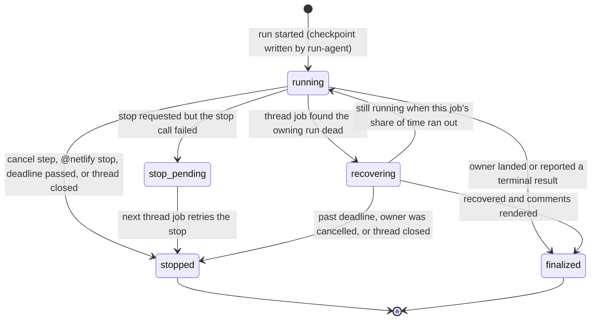

# Scope Guard, Run Recovery, Releases, and Ask Mode Plan

Status: spec (decisions from the 2026-09-25 interview are applied; see "Resolved Decisions")
Scope: four workstreams: (A) flag agent changes to protected or unexpected files, (B) durable run checkpoints and recovery of orphaned runs, (C) versioned releases with a moving `v1` tag, (D) an `ask` mode for questions that need no PR
Primary repo: `netlify-labs/agent-runner-action`
Consumers used for live verification: `netlify-labs/agent-runner-action-canary`, `netlify-labs/gtm-services`
Baseline: `main` at `10859ef` (SDK `nax-agent-runner-sdk@0.3.0`, agent/model/effort selection with OpenCode, runtime staged in `$RUNNER_TEMP`, crash-safe outcome reporting)

## Purpose

The action now reliably starts runs with the requested agent, model, and effort. The weak points have moved to what happens **around** a run:

1. **Agents change files nobody asked for.** Both live model tests in `gtm-services` (Fable 5, PR #54; Kimi K3, PR #56) went beyond a one-line task. They added deploy workarounds (`netlify.toml`, `redwood.toml`, `netlify/publish/index.html`), edited `AGENTS.md`, and created `pnpm-lock.yaml.txt`. Nothing in the result comment pointed this out. A reviewer who trusts "the agent did the task" could merge deploy-configuration changes by accident.
2. **Runs whose GitHub job dies are lost.** If the workflow job is cancelled, times out at the job level, loses its runner, or crashes after the agent starts, the Agent Runner keeps working on Netlify. Nothing lands its PR, and the status comment stays at "manifesting" indefinitely. For a *new* run the situation is worse: the runner ID is written to the status comment only at the very end of the job, so nothing durable even records which runner was started.
3. **Consumers can't pin a version.** The README and templates say `uses: netlify-labs/agent-runner-action@v1`, but the repo has no tags at all, so that reference fails to resolve. Every consumer pins a commit SHA by hand (`gtm-services` was bumped manually three times in one day).
4. **Questions need a PR.** Asking "how does the retry logic in `context-service` work?" today starts a normal run that may modify files and open a PR. The SDK already supports `mode: 'ask'`, but the action never uses it.

This plan covers all four, in an order that ships value early and keeps each PR independently reviewable and revertable.

## Current Ground Truth

All facts below were verified against `main` at `10859ef` and the published SDK `0.3.0`.

### Action pipeline (`action.yml`)

Composite steps, in order (abridged): `Check trigger` → `Install action dependencies` (id `install-deps`; stages `src/` + `package*.json` in `$RUNNER_TEMP/netlify-agent-runner-action`, runs `npm ci`, outputs `action-dir`) → `Acknowledge trigger` → `Get context information` (id `context-info`) → `Check trigger text size` → `Run preflight checks` → `Resolve bot identity` → `Find existing status comment` (id `find_comment`, filtered by `comment-author: <bot login>` and body `<!-- netlify-agent-run-status -->`) → `Find existing history comment` → `Extract existing agent run ID` (id `extract-agent-id`) → `Post preflight status comment` → `Fail on preflight failure` → `Check linked PR` → `Redirect to PR if issue has linked PR` → `Create initial status comment` (id `create_comment`) → `Create initial history comment` → `Checkout repository` → `Fetch base branch` → `Detect project type` → `Setup Bun` → `Cache Netlify CLI` → `Install Netlify CLI` → `Resolve Netlify site name` → `Update status to in-progress` → `Run Netlify Agent Runners` (id `netlify-agent`) → `Finalize Agent Runner pull request metadata` → `Manage labels` → `Generate success comment` / `Generate error comment` → `Post result comment` → `Generate status comment` → `Post or update status comment` → `Generate history comment` → `Post or update history comment` → `Cross-post to PR and update issue` → `Fallback status update` → `Update reaction on completion` → `Write GitHub step summary` → `Execution summary`.

Key conditions:

- `Update status to in-progress` runs only when `steps.extract-agent-id.outputs.agent-runner-id != ''`, meaning **only for follow-ups**. For a new run, the in-progress comment never gets a runner link or a `<!-- netlify-agent-runner-id:… -->` marker until the final status update.
- `Run Netlify Agent Runners` is one `node "$ACTION_DIR/src/run-agent.js"` process that starts (or follows up), waits, lands, and writes all outputs. A bash wrapper records `outcome=failure` if the script exits non-zero without reporting an outcome.
- `Manage labels` (opt-in `manage-labels: 'true'`) creates and applies `netlify-agent`, plus `security-fix` / `performance` keyword labels.

### `src/run-agent.js`

- `runAgentAction()` calls `sdk.start(...)` for new runs or `createLegacyHandle()` + `sdk.followUp(...)` for follow-ups, then `sdk.waitFor(handle)`, then `sdk.land(handle)` when `result.changes === 'changed'` and not dry-run.
- `saveHandleCheckpoint()` serializes the handle to `$RUNNER_TEMP/agent-runner-sdk-handle-<runnerId>.json` (mode `0600`) after start and after landing, and through the SDK `onLandingCheckpoint` hook. **`RUNNER_TEMP` is destroyed when the job ends**, so these checkpoints never outlive the job.
- `createLegacyHandle()` already rebuilds a valid SDK handle from only a runner ID, the site ID, and the listed sessions. It uses a placeholder prompt (`'Resume a pre-SDK agent-runner-action run.'`) and a UUID `requestId`, and validates the result through `sdk.parseHandle`. The SDK README discourages this ("Do not persist only runner/session IDs or construct handles by hand", line 255), so recovery uses it only as a fallback when the encrypted full handle can't be decrypted. Tested against 0.3.0: rebuilt `run` and `session` handles, including landing progress, pass `parseHandle` when request IDs are UUIDs, and are rejected otherwise (`input.requestId must be a UUID`).
- Result data available after `waitFor`: `RunResult` (SDK `dist/result.d.ts`) has `status`, `runnerId`, `sessionId`, `resultText`, `usage`, `changes: 'changed' | 'unchanged' | 'unknown'`, **`diff?: { kind: 'inline', text } | { kind: 'url', url }`**, `deployUrl`, and `links`. The diff is the **current session's** change set, not the PR's cumulative diff.

### SDK durable handles (`nax-agent-runner-sdk@0.3.0` README, "Durable handles and deadlines")

- Handles are version-stamped (`v: 1`) and contain **the original effective input (including the full prompt)**, `siteId`, `currentSessionId`, `policy` (`landing`, absolute `deadlineAt`, retry budget), retry progress, prompt-delivery metadata, and landing checkpoints (`prUrl`, `committedSessionIds`, …). `SessionHandle` adds `sessionId` and `sessionInput`.
- "`waitFor` enforces [`deadlineAt`] in-process. Out-of-band workers must compare the current time to `deadlineAt` and call `stop`."
- `getSnapshot(handle)` returns a non-blocking snapshot; `land(handle)` "creates or resumes a pull request"; landing failures are returned as data.
- Sessions echo `mode` (live sessions show `"mode": "normal"`), and `RunnerMode = 'normal' | 'create' | 'ask'` is accepted on both `start` and `followUp`. **The backend semantics of `ask` are not documented anywhere we have found** (not in the SDK README, NAX source, or NAX plans).
- Backend limitation recorded by NAX (2026-08-06): follow-up sessions accept `effort` but the session's `agent_config` does not echo it.

### Comment state (`src/comment-markers.js`)

- Markers: `<!-- netlify-agent-run-status -->`, `<!-- netlify-agent-run-history -->`, `<!-- netlify-agent-runner-id:… -->`, `<!-- netlify-agent-session-data:{json} -->`, `<!-- netlify-agent-run-result runnerId=… sessionId=… totalTokens=… -->`.
- `ALLOWED_MARKER_INNER` is an allowlist; `stripUntrustedHtmlComments()` removes any other HTML comment from user-influenced content before parsing, so outsiders cannot smuggle fake state.
- Session-data entries are sanitized per field (`pr_url`, `gh_action_url`, `screenshot` URL allowlists; `commit_sha` format; 2048-char cap).
- The status comment is found only among **bot-authored** comments, and the PR-body fallback is used only for same-repo PRs (see `extract-agent-id.js`). That is the trust anchor for durable state. Note: GitHub lets anyone with write access edit other users' comments, including the bot's ("Anyone with write access to a repository can edit comments on issues, discussions, pull requests, and commits," GitHub docs, *Managing disruptive comments*).
- GitHub's comment update API has no conditional write (no compare-and-swap), so comment content can't serve as a lock. Workflow **concurrency groups** are the only mutual-exclusion primitive available.

### Result and history comments

- `renderResultComment()` (`src/generate-result-comment.js`) writes the header `### [Run #N | <agent> | Agent Run completed](<agent run url>) ✅`, a usage line (tokens and credits already shown), the cleaned prompt, the result, links, and the result marker.
- The history TOC (`src/generate-history-toc.js`) parses that first line (`parseResultSummary`) to list runs. The per-run label is currently the **agent only**. Model and effort are not shown anywhere after the in-progress comment.

### Releases

- `git ls-remote --tags origin` returns nothing. `package.json` version is `1.0.0`.
- `.github/workflows/ci.yml` runs `bun test`, `docs:check`, and `tsc` on pushes to `main` and on PRs.
- `.github/workflows/canary.yml` triggers on `pull_request` (paths `action.yml`, `src/**`) and `workflow_dispatch` (inputs include `action_ref`). It is **not** callable with `workflow_call` today.
- Open bead `agent-runner-action-o70` "Release gate before moving @main or release tags" (P1) lists the required checks: tests, `tsc`, docs drift, no bead cycles, scenario harness, simulator sanity, and live example-repo smoke tests.

### Observed scope creep (evidence for Workstream A)

| Run | Model | Requested change | Files the PR actually touched |
|---|---|---|---|
| `gtm-services` #51 → PR #52 | codex (Auto), `low` | add `docs/agent-runner-smoke-test.md` | only that file |
| `gtm-services` #53 → PR #54 | claude `claude-fable-5`, `high` | add `docs/agent-runner-fable-smoke-test.md` | that file **plus** `netlify.toml`, `redwood.toml`, `netlify/publish/index.html` |
| `gtm-services` #55 → PR #56 | opencode `moonshotai/kimi-k3`, `max` | add `docs/agent-runner-kimi-smoke-test.md` | that file **plus** `AGENTS.md`, `netlify.toml`, `pnpm-lock.yaml.txt` |

The added files' own comments say why: the Agent Runners deploy ran `netlify deploy` from the monorepo root, the CLI stopped with "Projects detected: … Configure the project you want to work with", and the agent worked around it. The one-line Codex/Auto run did not (it took about 3 minutes, versus 11 to 15 for the others).

## Goals

1. Make every agent change to sensitive or unexpected files **visible in the result and status comments**, with optional label and draft escalation, without ever blocking a run by default.
2. Reduce scope creep at the source with a default scope instruction added to the agent prompt (teams can opt out).
3. Record a durable, secret-free checkpoint **as soon as a run starts**, so any later job can find and finish it.
4. Recover orphaned runs automatically: on the next `@netlify` comment in the same thread, and through an optional scheduled recovery workflow. Make stopping explicit: cancelling the workflow or commenting `@netlify stop` stops the agent.
5. Show the requested agent, model, and effort for every run in result and history comments, closing the backend's follow-up effort echo gap.
6. Publish immutable `vX.Y.Z` releases and a moving `v1` tag, gated on tests and a live canary, so `@v1` works and Dependabot can propose upgrades.
7. Support `ask` mode for questions: an answer in a comment, no commits, no PR.

## Non-Goals

- Blocking or reverting agent changes automatically. Workstream A reports and escalates; humans decide.
- Fixing the `gtm-services` monorepo deploy detection itself. That is a Netlify site-settings task, tracked separately. Workstream A only makes its side effects visible.
- Recovering `workflow_dispatch` runs that have no issue or PR. They have no status comment to hold a checkpoint. Their checkpoint still appears in the step summary for manual recovery.
- Queueing multiple pending prompts per thread. GitHub concurrency groups keep one running and one pending job per group; that existing limitation is out of scope (see Risks).
- GitHub Marketplace listing. It needs a manual UI step; the release workflow produces everything the listing needs.
- Arena-style multi-model runs.

## Design Principles

1. **Never block by default.** New checks add information to comments. Escalations (label, draft) are opt-in.
2. **No secrets, prompts, or site IDs in comments.** Durable state holds only identifiers and small enums. Some consumers treat `NETLIFY_SITE_ID` as a secret; GitHub does not mask secrets inside comment bodies the action writes through the API.
3. **Reuse the existing pipeline.** Recovery renders comments with the same `renderResultComment` / `renderStatusComment` / history functions. Ask mode reuses start, wait, and comments, and only skips landing.
4. **Bot-authored state only.** New markers follow the existing allowlist and bot-author trust model.
5. **Backward compatible within v1.** Existing comments without new markers behave exactly as today. New inputs default to current behavior.
6. **Every inline shell step has a test that executes it**, following `src/action-steps.test.js`.
7. **Verify live before calling it done.** Every workstream ends with a canary scenario and, where relevant, a `gtm-services` smoke test.

---

## Workstream A: Scope Guard

### User problem

A reviewer sees "✅ Agent Run completed" and a PR titled after the task. Nothing says "this PR also changes your deploy configuration and your agent instructions." In both observed cases the extra files were plausible-looking and easy to miss in a long diff.

### What the user sees

Result comment, after the result summary (only when something matched):

```markdown
#### ⚠️ Review these changes

This run changed files that usually need a closer look:

| File | Why it's flagged |
|---|---|
| `netlify.toml` | Protected path `**/netlify.toml` |
| `redwood.toml` | Protected path `*.toml` |
| `netlify/` (new folder) | New top-level folder |
| `pnpm-lock.yaml.txt` (new file) | New file at the repository root |

These may be unrelated to the request. Configure this check with `protected-paths`.
```

The status comment adds one line under the run line: `⚠️ 4 files outside the usual scope. See the result comment.`

**Where it appears:** wherever the run posts its result comment, **and on the PR**. When a run was triggered from an issue, the reviewer works on the PR, so the action also posts the same section as a comment on the PR the run opened or updated. When the run was triggered on the PR itself, the result comment already lives there and no second comment is posted.

**Files the request asked for aren't warnings.** If the user's prompt names a flagged file's path or basename (for example "fix the redirect in `netlify.toml`" or "add a CI job in `.github/workflows`"), that file moves to a separate "Requested" line instead of the warning table. For a folder pattern, naming the folder counts (`.github/workflows` covers `.github/workflows/ci.yml`).

With `protected-paths-action: label` the PR (or the issue, for dry runs) also gets the `netlify-agent:review-scope` label. With `draft`, an open PR created by this run is converted to a draft.

**Flags are comments only.** There is no GitHub check or commit status, so they never affect branch protection. Repos that want enforcement use CODEOWNERS on the same paths.

### Inputs

| Input | Default | Meaning |
|---|---|---|
| `protected-paths` | built-in list (below) | Newline- or comma-separated glob patterns. `default` expands to the built-in list, so users can add to it (`default, infra/**`). `none` disables pattern checks. A leading `!` excludes a match (later patterns win). |
| `flag-new-top-level` | `'true'` | Report files added at the repository root and new top-level folders. |
| `protected-paths-action` | `'comment'` | Comma list of `comment`, `label`, `draft`. `comment` is always implied while any check is enabled. |
| `scope-instructions` | `'default'` | Text appended to the agent prompt (see below). `default` uses the built-in text; any other value replaces it; an empty string (`''`) disables it. |

New outputs: `scope-flags` (JSON array of `{ path, reason, rule }`), `scope-flag-count`.

### Built-in protected list and why

| Pattern | Why |
|---|---|
| `.github/**` | Workflows run with repository secrets. Workflow edits are a security-sensitive change. |
| `**/netlify.toml` | Build and deploy configuration (observed: Fable and Kimi). |
| `*.toml` | Root-level tool configuration such as `redwood.toml` (observed: Fable). Root only, so `packages/x/pyproject.toml` isn't flagged. |
| `**/package-lock.json`, `**/pnpm-lock.yaml`, `**/yarn.lock`, `**/bun.lock`, `**/bun.lockb` | Lockfile churn is rarely part of a small request and hides dependency changes. |
| `**/pnpm-workspace.yaml` | Changes the workspace graph. |
| `AGENTS.md`, `CLAUDE.md`, `**/AGENTS.md` | Changes how future agents behave in this repo (observed: Kimi). |
| `**/.env*` | Likely secrets. |

The new-top-level check catches the two observed files no pattern would: `netlify/publish/index.html` (new top-level folder `netlify/`) and `pnpm-lock.yaml.txt` (new root file).

### Glob semantics (`src/path-globs.js`, new)

Zero-dependency matcher on repo-relative POSIX paths:

- `**` matches any sequence including `/`; `**/` at the start also matches zero directories (so `**/netlify.toml` matches `netlify.toml`).
- `*` matches any sequence **not** containing `/`; `?` matches one non-`/` character; `{a,b}` alternation.
- A pattern without `/` matches **only at the root** (`*.toml`, `AGENTS.md`). This is deliberately stricter than `.gitignore`, where a slash-less pattern matches at any depth. Explicit `**/` keeps the list readable and avoids surprises. Document this prominently.
- `!pattern` negates. Evaluation is in order, and the last matching pattern decides.
- Case-sensitive, like git.

### Where the changed-file list comes from

GitHub's file metadata is the primary source. Diff parsing is only a best-effort fallback for runs that land nothing.

1. **New PR opened by this run:** `GET /repos/{o}/{r}/pulls/{n}/files`, paginated (100 per page; the API returns at most 3,000 files). On a brand-new PR this is exactly this run's change set.
2. **Follow-up committed to an existing PR:** `GET /repos/{o}/{r}/commits/{commitSha}` for `currentSession.commitSha`, paginating `files` (the API caps files per commit at 3,000).
3. **Dry run and ask mode** (nothing landed): parse `RunResult.diff` when it's `kind: 'inline'`. This is best-effort, because the SDK types don't promise a complete Git extended-header diff. The parser:
   - reads `diff --git` headers and `new file mode` / `deleted file mode` / `rename from` / `rename to` / `similarity index` lines
   - implements Git's `core.quotePath` C-style unescaping (octal escapes for non-ASCII bytes, `\t`, `\n`, `\"`, `\\`)
   - handles `/dev/null` sides and binary markers
   - rejects malformed headers instead of guessing

   `kind: 'url'` diffs aren't fetched.
4. **Incomplete data is said out loud:** if a list hit an API cap, the diff was missing or malformed, or a parse rejected lines, the scope section says "Couldn't check every changed file (reason)". It never claims a clean result it can't prove. If no file list is available at all, only the step summary mentions it.

Each rule has fixtures: paginated PR files, a 3,000-file cap, quoted paths with spaces, tabs and UTF-8 bytes, renames, deletions, binary files, mode-only changes, and malformed input.

New-top-level detection:

- **Root files:** added files (`status: added`, or `new file mode`) whose path has no `/`.
- **Top-level folders:** for each distinct first path segment among added files, check whether it exists on the base ref: `GET /repos/{o}/{r}/contents/{segment}?ref={base}`, where 404 means new. At most 10 lookups per run; beyond that, report "and N more new top-level entries" without checking.

### Pipeline placement

- `src/scope-guard.js` (new, pure): `collectChangedFiles({ diffText, commitFiles })`, `evaluateScope({ files, patterns, baseTopLevel })`, and `renderScopeSection(flags)`, which escapes paths for Markdown, caps the list at 20 rows plus "and N more", and never renders HTML comments.
- `run-agent.js`: in dry-run and ask mode, write the parsed inline-diff file list to `$RUNNER_TEMP/agent-scope-<runnerId>.json`. Landed runs are left to the next step.
- New step **`Check run scope`** (github-script, after `Run Netlify Agent Runners`, `continue-on-error: true`): fetches the PR or commit file list (it has the GitHub client), runs the top-level lookups, evaluates the patterns, writes `scope-flags` / `scope-flag-count` outputs and the flags file for renderers, and applies the `label` / `draft` actions.
  - `draft` uses GraphQL `convertPullRequestToDraft` (allowed for a workflow token with `pull-requests: write`, whoever opened the PR). It is attempted only when this run *created* the PR and the PR is open and not already a draft, using the node ID fetched from the PR API. Failures (token policy, repository rules, unsupported state) are non-fatal and reported in the step summary.
- `renderResultComment` and `renderStatusComment` read the flags file or env and add the section and the one-liner.

### Scope instructions

By default (`scope-instructions: default`), `run-agent.js` appends a delimited block to the prompt sent to the SDK:

```text
<prompt>

---
Scope guidance from this repository's workflow:
Only modify files needed for this task. If a build or deploy fails for reasons unrelated to your task, do not change build, deploy, or workspace configuration to work around it; finish the task and describe the failure in your result.
```

This is on by default because both observed scope-creep runs added workaround files after a deploy failure unrelated to their task. Under the versioning policy (Workstream C), additions to agent guidance are a minor behavior change, announced under "Behavior changes" in the release notes.

- The block is appended **after** the trigger-size check. Its size counts toward the SDK prompt limit (`NAX_SAFE_PROMPT_BYTES`, default 16 KiB with blob fallback), so `Check trigger text size` must include the configured instruction length.
- Display strips the block. `utils.cleanPrompt` removes the exact delimited block (matched on the fixed header line) so comments show only what the user wrote. The result comment renders prompts from `latestSession.prompt`, which will include the block, so this stripping is required.
- Repos opt out with `scope-instructions: ''`.

### Tests (Workstream A)

- `path-globs.test.js`: table tests for every operator, root-only semantics, negation order, case sensitivity, and each built-in pattern against positive and negative paths.
- `scope-guard.test.js`:
  - diff parsing fixtures, one per edge case above
  - **reconstructed fixtures from PR #54 and PR #56** (their file lists), asserting exactly the flags shown in the UX example
  - PR #52's file list, asserting no flags
- Rendering: escaping of hostile file names (backticks, `|`, `<!--`, `[x](y)`), the 20-row cap, and the status one-liner.
- `action-steps.test.js`: the `Check run scope` step is gated correctly and `continue-on-error`.
- Prompt: the scope block is appended by default, omitted with `scope-instructions: ''`, replaced by custom text, stripped from every display path (status, result, history, PR title cleanup), and counted in the size check.
- "Requested" suppression: a path or basename named in the prompt moves to "Requested"; a named folder covers files beneath it; mentions inside code spans still count (users often write `` `netlify.toml` ``); substring accidents don't count (`toml` alone doesn't suppress `netlify.toml`).
- PR placement: an issue-triggered run posts the section on the PR too; a PR-triggered run posts it once.
- **Live:** canary scenario "scope creep". The canary prompt asks for the marker line *and* an edit to `netlify.toml` in the canary repo. The controller asserts that the result comment contains the scope section naming `netlify.toml`.

---

## Workstream B: Run Checkpoints and Recovery

### Failure modes this fixes

| Failure | Today | After |
|---|---|---|
| Job cancelled while the agent runs | Agent keeps running; comment stuck at "manifesting"; for new runs nothing records the runner | **Cancel means stop:** a cancel step stops the agent and marks the run stopped |
| Job-level `timeout-minutes` shorter than the agent's time limit plus setup | GitHub cancels the job at its timeout; same as above | With the new `job-timeout-minutes` input, preflight warns and shortens the agent's limit to fit, so the agent's own timeout fires first and reports cleanly |
| Runner machine lost, or crash after `sdk.start` | Same; the crash wrapper now reports failure, but the work is still lost | Recovered by the next `@netlify` comment or the optional recovery cron (which dispatches the thread's workflow) |
| Cancel step didn't finish (cleanup is best-effort) | n/a | Recovery sees the owner run's `cancelled` conclusion and stops the agent instead of landing |
| No way to stop a run from the thread | Only by cancelling the workflow, which didn't stop the agent | `@netlify stop` |
| Follow-up effort not echoed by the backend | History shows only the agent | Requested agent/model/effort recorded per session |

### Where the handle lives: encrypted in the status comment

The SDK's contract is to persist the **complete** handle returned by every mutating call ("Do not persist only runner/session IDs or construct handles by hand", SDK README line 255). The handle contains the original prompt, the `siteId`, retry state, prompt-delivery metadata, and landing progress (`prUrl`, `committedSessionIds`, `expectedPrHeadSha`). Resumable landing depends on that progress. Publishing the handle in plain text would repost prompts and expose the site ID, which some consumers keep as a secret.

So the status comment stores the **full serialized handle, encrypted**:

- **Cipher:** AES-256-GCM (`node:crypto`), random 96-bit nonce per write.
- **Key:** HKDF-SHA256 with the `NETLIFY_AUTH_TOKEN` value as input key material, `salt = "<owner>/<repo>"`, and `info = "netlify-agent-run-checkpoint/v1"`. Only jobs that hold the token can decrypt. The token never leaves the runner.
- **Binding:** the GCM additional authenticated data is `"<owner>/<repo>#<issue-or-PR number>:<runnerId>"`. A ciphertext copied into another thread, or paired with a different runner ID, fails authentication.
- **Size:** GitHub comments are capped at 65,536 characters, and the status body uses a few KB. If the base64url ciphertext would exceed 40,000 characters, the handle is re-serialized with `input.prompt` / `sessionInput.prompt` replaced by a fixed placeholder before encrypting. The prompt is only needed for ambiguous-create reconciliation, which is finished by then. The summary records "handle stored without prompt".
- **Fallback:** if decryption fails (token rotated, key version unknown, ciphertext missing), recovery rebuilds a handle from the public fields, the same way `createLegacyHandle` already does in production. This was tested against SDK 0.3.0: rebuilt `run` and `session` handles, including landing progress, pass `sdk.parseHandle` when request IDs are UUIDs. The public fields therefore include the landing progress needed for that rebuild.
- **Updates:** the checkpoint is rewritten after every SDK call that returns a new handle: start or follow-up, every `onLandingCheckpoint`, and landing.

### Checkpoint marker

`<!-- netlify-agent-run-checkpoint:{json} -->`, stored in the **status comment** (bot-authored, already the source of truth for `runner-id`).

```jsonc
{
  "v": 1,
  "state": "running",            // running | stop-pending | recovering | finalized | stopped
  "runnerId": "6ab5de0c…",       // RUNNER_ID_FORMAT
  "sessionId": "6ab5de0c…",      // current session (== handle.currentSessionId)
  "kind": "run",                 // run (new runner) | session (follow-up)
  "agent": "opencode",           // catalog provider
  "model": "moonshotai/kimi-k3", // optional, MODEL_ID_PATTERN
  "effort": "max",               // optional, EFFORT_WORDS (wire value)
  "mode": "normal",              // normal | ask
  "landing": "pr",               // pr | none (dry run / ask)
  "deadlineAt": 1790000000000,   // handle.policy.deadlineAt (ms epoch), never rewritten
  "startedAt": 1789998500000,
  "ghRunId": 36086874799,        // workflow run that owns it
  "ghRunAttempt": 1,
  "requester": "DavidWells",     // login that triggered the run (for @-mention on recovery)
  "prHeadSha": "2a62981…",       // PR head when the session started (follow-ups on a PR)
  "prUrl": "https://github.com/o/r/pull/56",   // PR URL allowlist
  "committedSessionIds": ["…"],  // landing progress, for the rebuild fallback
  "kv": 1,                       // key/cipher version
  "handle": "<base64url nonce‖ciphertext‖tag>"
}
```

- `comment-markers.js` gains `renderCheckpointMarker()` / `parseCheckpoint()`. Parsing validates every public field against the formats used elsewhere (runner ID, model ID, effort words, PR URL allowlist, SHA format, finite integers, base64url with a length cap). It drops the whole checkpoint when `v` or `kv` is unknown or any required field is invalid.
- `ALLOWED_MARKER_INNER` adds `run-checkpoint:`.
- `extract-agent-id.js` outputs `checkpoint` (validated public fields plus ciphertext) and `checkpoint-state`.
- After decrypting, recovery compares the handle's `runnerId`, `currentSessionId` and `siteId` with the public fields and the configured site. On any mismatch it skips with a warning, so public fields edited by hand can't redirect recovery.

### Single writer per thread

GitHub comment updates have no compare-and-swap, so a lease written into the comment can't provide mutual exclusion: two jobs can both write and then both read back their own lease. The only reliable lock GitHub offers is a **workflow concurrency group**. The design rule is:

> Only the job that holds the thread's concurrency group (`netlify-<repo>-<thread>`) writes the thread's status comment and checkpoint, lands, or recovers.

- Trigger jobs already hold the thread group.
- The recovery cron **doesn't recover anything itself**. It dispatches the main workflow once per unfinished thread (`workflow_dispatch` with input `recover_thread: <number>`). The template's concurrency group includes that input, so the recovery run queues and serializes with any trigger job on the same thread.
- `@netlify stop` runs **outside** the thread group (it must not queue behind the run it stops). So it never writes the status comment while an owner is alive (see below).

### Lifecycle



(`stop_pending` is written `stop-pending` in the marker.) `finalized` and `stopped` are terminal. A later follow-up writes a new checkpoint for its new session.

### Pipeline changes

1. **Keep one run step** (`Run Netlify Agent Runners`, id `netlify-agent`). Splitting it into start and finish steps would move outputs between step IDs and break every `steps.netlify-agent.outputs.*` reference in `action.yml`. Instead, `run-agent.js` itself writes the checkpoint to the status comment right after `sdk.start` / `sdk.followUp` returns, and again after landing:
   - It already has `GITHUB_TOKEN`. New env: `STATUS_COMMENT_ID` (`steps.find_comment.outputs.comment-id || steps.create_comment.outputs.comment-id`), `ISSUE_NUMBER`, `GITHUB_REPOSITORY`, and the model/effort labels.
   - It renders the in-progress body with the existing `utils.buildInProgressComment` (now including the agent-run link and runner-ID marker) plus the checkpoint marker, and `PATCH`es the comment.
   - This fixes a visible gap too: new runs finally show "View the in progress agent run" while running, not only follow-ups. `Update status to in-progress` is removed; its follow-up behavior moves here.
   - A failed checkpoint write is a warning (annotation and step summary "checkpoint not persisted: run can't be recovered if this job dies"). The run continues.
   - Outputs, failure paths and the crash-fallback wrapper are unchanged. New output: `checkpoint-written` (`true`/`false`).
2. **New step `Stop agent on cancel`** with `if: cancelled() && steps.install-deps.outputs.action-dir != ''`. It loads the handle file from `$RUNNER_TEMP` (a no-op if none exists), calls `sdk.stop`, sets `state: stopped`, and updates the status comment: "⏹ The workflow was cancelled, so the agent run was stopped."
   - **This is best-effort.** It runs on a manual cancel, but GitHub doesn't guarantee cleanup steps finish, and a lost runner runs nothing at all. So recovery also honors cancel intent: an owning run whose conclusion is `cancelled` means "stop", not "land" (see the recovery rules).
   - If the stop call fails, it writes `state: stop-pending`.
3. **`job-timeout-minutes` input and preflight check.** Reading `timeout-minutes` back out of workflow YAML is unreliable (expressions, matrices, reusable workflows, and `github.sha` vs `GITHUB_WORKFLOW_REF`). So the templates pass the job's timeout explicitly (`job-timeout-minutes: 35` next to `timeout-minutes: 30`). When it's set and `timeout-minutes + 5 > job-timeout-minutes`, preflight warns (log and step summary) and **shortens the agent's limit** to `job-timeout-minutes − 5` for this run, so the agent's own deadline fires first and reports cleanly. When it's empty, the check is skipped and the step summary suggests setting it.
4. **Final status rendering** re-reads the status comment, merges the latest checkpoint (so it never overwrites a `stopped` state or a stop request, see below), and writes `state: finalized` or `stopped`.

### Recovery engine (`src/recover-run.js`, new)

```js
recoverRun({ sdk, github, repo, thread, statusComment, checkpoint, input, budgetMs, now })
  -> { outcome: 'finalized' | 'stopped' | 'still-running' | 'skipped', reason, sessionDataMap }
```

It only ever runs inside a job that holds the thread's concurrency group (the trigger job, or the dispatched recovery run).

1. **Get the handle:** decrypt the checkpoint handle. If that fails, rebuild it from the public fields. Verify `runner.siteId === input.siteId` and that the session exists; otherwise skip (`site-mismatch` / `missing-session`).
2. **Pre-checks, in order:**
   - **Owner still running** (`GET /actions/runs/{ghRunId}` is queued/in progress): skip. This shouldn't happen inside the thread group, but it's a cheap guard.
   - **Owner was cancelled** (conclusion `cancelled`): the cancel step didn't finish. `sdk.stop` if active, then post "Stopped: the workflow was cancelled" → `stopped`.
   - **Thread closed** (issue closed, or PR closed or merged): `sdk.stop` if active. Never land. Post "Stopped: this thread was closed before the run finished" → `stopped`.
   - **`stop-pending`:** retry `sdk.stop` → `stopped`.
   - **Past deadline** (`now ≥ deadlineAt`) and still active: `sdk.stop` as the SDK requires of out-of-band workers, then post a timed-out result → `stopped`. `deadlineAt` is the run's agent time limit, which preflight fits inside the job timeout. So an orphaned run gets exactly the time its job would have given it.
3. **Then from `sdk.getSnapshot(handle)`:**

| Snapshot | Action |
|---|---|
| terminal succeeded, changes, not landed (`landing: pr`), PR head unchanged | `sdk.land(handle)` → persist the returned handle → render result/status/history → `finalized` |
| terminal succeeded, changes, not landed, **PR head moved** since `prHeadSha` | don't land; render the result with "Not applied: the branch changed after this run started. See the agent run to apply it manually." → `finalized` |
| terminal succeeded, already landed or no changes | render comments only → `finalized` |
| terminal failed / cancelled | render failure comments → `finalized` |
| active, before deadline | `sdk.waitFor` with this job's budget enforced by an `AbortSignal` (the handle's `deadlineAt` is **not** modified); re-decide; if still active → `still-running` (state stays `running`) |

4. **Rendering** reuses existing modules: write `agent-sessions-<runnerId>.json` exactly as `run-agent.js` does, then call `renderResultComment` and post or update the comments with the same markers. The header gets a `· recovered` suffix, and the body starts with "@<requester>, your earlier request finished." `renderStatusComment` and `renderHistoryTocFromComments` follow.
5. **Idempotency:** recovery runs under a single writer, so duplicates can only come from retries of the same job. A session that already has a result comment (`parseResultCommentIdentifiers` finds its `sessionId`) never gets a second one, and `sdk.land` resumes from the handle's landing progress.

### Recovery on the next trigger ("finish before follow")

When a trigger job (already holding the thread group) finds a `running` or `stop-pending` checkpoint:

- A new step **`Recover unfinished run`** (github-script, requires the staged SDK via `ACTION_DIR`, `NETLIFY_AUTH_TOKEN` in env) runs `recoverRun` before the run step.
- **Wait, then run the new request.** Recovery may use at most **40% of the effective agent time limit** (after any preflight shortening). The rest is reserved for the new request.
- If recovery finishes within that share, the new prompt continues as a normal follow-up on the same runner. The user sees the recovered result and then the new one.
- If the old session is still running when its share is used up, the job posts "The previous run is still working, so this request wasn't started. Comment again once it finishes." It does **not** start the new prompt; nothing queues it, and the message must not promise that.
- Downstream steps use the recovered `session-data-map` (`steps.recover.outputs.session-data-map || steps.extract-agent-id.outputs.session-data-map`).

### Scheduled recovery (opt-in cron workflow)

What it is: an **optional second workflow file** that a repo adds next to its main one. GitHub starts it on a timer (`on: schedule`); it doesn't react to comments. It **finds** threads with unfinished runs and **dispatches the main workflow** for each, so every recovery runs inside that thread's concurrency group. Without it, an orphaned run is picked up only when someone comments `@netlify` again on that thread.

Cost and caveats to document: a scan with nothing to do takes about 20 to 30 seconds of Actions time (roughly 15 to 25 minutes a day at every 30 minutes). GitHub may delay scheduled runs under load and disables schedules in public repos after 60 days without activity.

A new action input `operation: 'trigger' | 'recover-scan'` (default `trigger`). With `recover-scan`, the composite runs a short path: install deps → `Find unfinished runs` → dispatch → step summary. The main workflow template gains a `recover_thread` dispatch input; a dispatch that carries it recovers that thread and starts nothing new. The new template `workflow-templates/netlify-agents-recover.yml`:

```yaml
on:
  schedule: [{ cron: '*/30 * * * *' }]
  workflow_dispatch:
concurrency: { group: netlify-agents-recover-scan, cancel-in-progress: false }
permissions: { contents: read, issues: read, pull-requests: read, actions: write }
jobs:
  scan:
    runs-on: ubuntu-latest
    timeout-minutes: 10
    steps:
      - uses: netlify-labs/agent-runner-action@v1
        with:
          operation: recover-scan
          recover-workflow: netlify-agents.yml   # the main workflow file to dispatch
          netlify-auth-token: ${{ secrets.NETLIFY_AUTH_TOKEN }}
          netlify-site-id: ${{ secrets.NETLIFY_SITE_ID }}
```

Scan algorithm (`src/scan-unfinished-runs.js`):

1. `GET /repos/{o}/{r}/issues?state=all&sort=updated&direction=desc&since=<now − recover-lookback-hours>` (includes PRs; default 48 hours), capped at `recover-max-items` (default 50). Closed items are included so their still-running agents get stopped. The default is safe because `timeout-minutes` is capped at 24 hours (`MAX_TIMEOUT_MINUTES` in `run-agent.js`) and each checkpoint write updates the thread.
2. For each item, find the bot's status comment and parse the checkpoint's public fields (no decryption is needed to scan). Skip if absent, `finalized`, or `stopped`.
3. Skip if the owning run (`ghRunId`) is still queued or in progress.
4. `POST /repos/{o}/{r}/actions/workflows/{recover-workflow}/dispatches` with `ref` = the default branch and `inputs.recover_thread` = the number. The workflow's concurrency group serializes it with any trigger job on that thread. Double dispatches are harmless: the second run finds a terminal checkpoint and exits.
5. Write a summary table: item, runner, state, dispatched or skipped (with reason).

### `@netlify stop`

A write-access user (the same `allowed-users` / collaborator rule as starting runs) posts a comment whose entire text is `@netlify stop`:

1. **Scope:** only `issue_comment` and `pull_request_review_comment` events. On other events (issue title/body, PR body, review body, dispatch), `@netlify stop` is not a command, and the action replies "Stop only works as its own comment."
2. The stop run reads the checkpoint public fields and calls `sdk.stop` on that runner (idempotent).
3. **It doesn't write the status comment while the owner is alive.** It posts its own reply ("⏹ Stopping the agent run, requested by @user") with a `<!-- netlify-agent-stop-request:{"runnerId":…,"by":…} -->` marker. The owner job, still in `waitFor`, sees the run end as cancelled. Its final rendering re-reads the thread, finds the bot-authored stop request for its runner, renders "⏹ Stopped by @user" (not a failure), and writes `state: stopped`.
4. If the owner is dead (its run completed), the stop run writes the stop-request reply and dispatches the main workflow with `recover_thread` (same as the cron), so the status comment update happens under the thread lock.
5. With no active run: reply "Nothing to stop: the last run already finished."

Grammar: the parser recognizes stop only when the trimmed comment body, case-insensitively, is exactly `@netlify stop`. `@netlify stop the cron job from firing twice` stays a normal build request. The catalog-integrity test adds `stop` to the reserved words.

**Concurrency routing** (templates). Stop comments need their own group so they don't queue behind the run they stop. GitHub expressions have no regex or trim, so the routing uses an exact equality check, which is case-insensitive for strings in GitHub expressions:

```yaml
concurrency:
  group: ${{ (github.event_name == 'issue_comment' || github.event_name == 'pull_request_review_comment') && github.event.comment.body == '@netlify stop' && format('netlify-stop-{0}', github.run_id) || format('netlify-{0}-{1}', github.repository, github.event.pull_request.number || github.event.issue.number || inputs.recover_thread || github.run_id) }}
  cancel-in-progress: false
```

- The parser and the routing both use exact whole-comment matching, so a longer prompt containing `@netlify stop` never bypasses the thread group.
- A stop comment with extra whitespace fails the routing but passes the parser (which trims), so it queues and then replies "Nothing to stop". That degrades safely.
- Workflow files without the new expression degrade the same way. To tell maintainers, preflight fetches the running workflow file (path from `GITHUB_WORKFLOW_REF`, contents API) and does a plain text search for `netlify-stop-`; no YAML evaluation is involved. If it's missing, the log and step summary show "Workflow file updates available: add the stop-aware concurrency group" (never a comment). If the fetch fails, the check is silently skipped.

### Per-run agent, model, and effort

- Session-data entries gain `agent`, `model`, `effort`, and `mode` fields (sanitized: provider list, `MODEL_ID_PATTERN`, `EFFORT_WORDS`, mode enum), written from the resolved selection when each session starts.
- `renderResultComment` header becomes `### [Run #N | claude · Fable 5 · high | Agent Run completed](…)`. It prefers the session's `agent_config` when present and falls back to the session-data request, so follow-up effort appears even though the backend doesn't echo it.
- `parseResultSummary` keeps parsing old headers (agent only) and new headers. The TOC shows the full segment.

### Security review (Workstream B)

- **Who can write state:** checkpoints and stop requests are read only from comments authored by the bot identity (`steps.bot-identity.outputs.login`). GitHub lets **anyone with write access edit other users' comments**, and any workflow or integration that runs as the same bot identity can too. Login alone is not cryptographic provenance. Write-access users are already trusted to start, steer, and stop runs, so this is within the existing trust model, and the design limits what an edit can do:
  - the encrypted handle is authenticated with GCM and bound to repo, thread and runner, so edits to it are detected
  - edited public fields are cross-checked against the decrypted handle and the configured site
  - recovery never creates runs; it only waits, lands, stops, and comments
- **No plaintext secrets in markers:** the prompt and site ID exist only inside the ciphertext. Tests serialize a checkpoint from a handle containing canary strings (`PROMPT_CANARY_…`, `SITE_CANARY_…`) and assert that neither appears in the rendered comment.
- **Edited trigger comments:** `issue_comment` `edited` events re-run authorization for the editor, and the requester recorded in the checkpoint is the login of the event's `sender`.
- **Permissions:** the scan workflow needs only read permissions plus `actions: write` to dispatch, and it never checks out code or decrypts.

### Tests (Workstream B)

- **Crypto:** encrypt/decrypt round-trip; tampered ciphertext, nonce, or tag fails; ciphertext moved to another thread or runner fails via AAD; wrong token fails and triggers the rebuild fallback; prompt stripping above the size cap; key-version handling.
- **Markers:** round-trip and sanitization; invalid fields drop the checkpoint; unknown `v`/`kv`; allowlist stripping of forged checkpoints in user comments; the canary-string assertions.
- **Rebuild fallback:** `run` and `session` kinds with landing progress pass `sdk.parseHandle` (UUID request IDs); site mismatch; missing session; public-field/handle mismatch skips.
- **`recoverRun`:** every pre-check and decision-table row against a fake transport, the same style as `run-agent.test.js` `dryRunTransport`. That includes owner cancelled → stop, past deadline → stop, the `AbortSignal` budget with an injected clock (and `deadlineAt` unchanged), the 40% budget split, moved PR head, the requester @-mention, and idempotency.
- **`run-agent` checkpoint writes:** the comment is PATCHed after start and after landing; a failed write gives `checkpoint-written=false` and a warning without failing the run; existing outputs are unchanged (the existing `run-agent` scenarios still pass untouched).
- **Final rendering merge:** a stop request or `stopped` state written by another job is preserved; a stop plus a simultaneous successful completion renders "Stopped by", and the landing outcome is still reported if it already happened.
- **Cancel step:** it calls stop and writes `stopped`; a failing stop writes `stop-pending`; no handle file means a no-op.
- **`job-timeout-minutes`:** shortening, warning placement, empty input skips.
- **Scan:** it selects only unfinished checkpoints with dead owners, dispatches with the right inputs, and caps the lookback and item count. A double dispatch is harmless (the second run finds a terminal state).
- **`@netlify stop`:** exact-comment parsing, the event scope, the permission check, the routing expression in all templates (evaluated by a tiny expression-evaluator test over fixture events for all six trigger types), "Nothing to stop", and the dead-owner dispatch path.
- **`action-steps.test.js`:** the cancel step's condition, the recovery step loads from `ACTION_DIR`, and the run step receives `STATUS_COMMENT_ID`.
- **History parsing:** old-format and new-format headers.
- **Live canary scenarios:**
  - **"cancel stops":** cancel the downstream run after the checkpoint appears; assert the backend runner is stopped, the checkpoint is `stopped`, and no PR was created.
  - **"orphan recovery":**
    1. Start a run with the test-only input `simulate-orphan: true`, which makes `run-agent.js` exit right after writing the checkpoint, leaving `state: running` and a completed (successful) owning run, which is what a lost runner leaves.
    2. Dispatch the scan workflow.
    3. Assert that a `recover_thread` run was dispatched, the PR landed, the result has the `recovered` suffix and the @-mention, and the checkpoint is `finalized`.
  - **"stop command":** start a run, comment `@netlify stop`, and assert "Stopped by @…" in the status comment and the `stopped` checkpoint.

---

## Workstream C: Releases and the `v1` Tag

### Decisions

- **SemVer tags** `vX.Y.Z` are immutable. **Moving major tag** `v1` always points at the latest `v1.Y.Z`. This is the standard GitHub Actions convention, and what the templates already reference.
- **First release `v1.0.0`** is the merge commit of the release-workflow PR. Current behavior is what consumers already run by SHA.
- **Breaking changes** (they require `v2`) are changes that break a consumer's workflow or stored state: removing or renaming an input or output; changing an input's accepted values; changing comment marker formats so older action versions can't read newer comments, or the reverse; changing the mention grammar so previously valid mentions resolve to a different agent, model, or effort.
- **Minor changes** include additive inputs and outputs, new markers old versions ignore, new mention forms that were previously plain prompt text, and **changes to agent guidance or comment content** (for example the default scope instruction or new comment sections). Behavior changes like these are listed under a "Behavior changes" heading in the release notes.
- **Required workflow-file updates** (for example the stop-aware concurrency group) are never required for existing behavior to keep working. They go under an "Action required to use new features" heading.
- **Release notes** come from `gh release create --generate-notes`, categorized by a `.github/release.yml` label config (`feat`, `fix`, `docs`, `ci`). The bead `agent-runner-action-o70` becomes the release checklist and closes when `v1.0.0` ships.

### `.github/workflows/release.yml` (new)

Trigger: `workflow_dispatch` with inputs `version` (for example `1.1.0`, without the `v` prefix) and `dry_run` (default `true`).

Jobs:

1. `validate`:
   - `version` is valid SemVer without prerelease.
   - `v<version>` doesn't exist and is greater than the latest `v1.*`.
   - The major is `1` (a `2.x` release needs a deliberate workflow edit).
   - `GITHUB_SHA` is the current `main` HEAD. This check is **required when publishing**. On a dry run from another branch it is reported as "skipped (not main)", so the workflow logic can be tested on a branch.
2. `checks`, on that SHA: `bun test src/*.test.js`, `bunx tsc --noEmit`, `bun run docs:check`, `bun run simulate -- --fixture fixtures/events/issue-opened-body-trigger.json --format json`, and `br dep cycles --json` (skipped when `br` isn't installed in CI; recorded as a warning).
3. `canary`: `uses: ./.github/workflows/canary.yml` with `action_ref: ${{ github.sha }}`, `secrets: inherit`. **Requires adding `workflow_call`** (same inputs as `workflow_dispatch`) to `canary.yml`.
4. `publish` (`needs: [validate, checks, canary]`, skipped when `dry_run`):
   - Create the annotated tag `v<version>` on the SHA and push it.
   - Force-move `v1` to the same SHA with `git tag -f v1 && git push -f origin v1`.
   - Run `gh release create v<version> --generate-notes --verify-tag`.
   - Permissions: `contents: write`.

### Repository settings (manual, documented in the plan's checklist)

- Two tag rulesets, because the moving major tag and the immutable release tags need opposite rules:
  - `v[0-9]*.[0-9]*.[0-9]*` (release tags): creation only by the release workflow (GitHub Actions bypass) and admins; **updates and deletion blocked for everyone**, so release tags are immutable.
  - `v1` (the moving major tag): updates (force-push) only by the release workflow and admins; deletion blocked.
- **No approval environment.** Any maintainer who can dispatch `release.yml` can publish once tests and the canary pass; the canary is the gate.

### Docs and templates

- README "Versioning" section:
  - use `@v1` for automatic minor and patch updates
  - or pin a SHA with a version comment (`uses: netlify-labs/agent-runner-action@<sha> # v1.2.0`) and let Dependabot's `github-actions` ecosystem update it
  - an example `.github/dependabot.yml`
- `check-docs-drift.js` gains a check that templates and the README reference `@v1` (not `@main` or a SHA).
- After `v1.0.0`: move `gtm-services` to a SHA pin with a version comment (`@<sha> # v1.0.0`) and add a `.github/dependabot.yml` with the `github-actions` ecosystem, so new releases arrive as reviewed PRs. Move the example repo from `@main` to `@v1`. The canary repo keeps SHA pins, since it tests specific commits by design.

### Tests (Workstream C)

- `actionlint` on the new workflows, added to CI.
- A `release.yml` dry run on a branch (`dry_run: true`) proves validation (with the main-HEAD check reported as skipped), checks, and canary without publishing. The first real dry run, and every publish, runs from `main`.
- Validation logic lives in `src/release-version.js` (pure: parse, compare, next-version checks) with unit tests, called by the workflow with `node`.

---

## Workstream D: Ask Mode

### Phase D0: Probe the backend first

The SDK forwards `mode: 'ask'`, but nothing documents what the backend does with it. Before any UX work, add `scripts/probe-ask-mode.mjs`. It is mutation-gated like NAX's `probe-agent-runner-model-effort.mjs`: it requires `ALLOW_AGENT_RUNNER_ASK_PROBE=1` and runs only against the canary site. It records answers to:

1. With `start({ mode: 'ask' })`, does the session echo `mode: "ask"`, and are `has_result_diff` / `commit_sha` always empty? What does `result` contain (Markdown? length)?
2. Can a runner created in ask mode take a **normal** follow-up that changes files, and does `sdk.land` then open a PR normally?
3. Does `followUp({ mode: 'ask' })` on a runner that already has a PR avoid committing, and does it see the PR branch's code?
4. Cost and duration versus a normal run on the same prompt (usage from the session).
5. What happens if an ask session produces a diff anyway: is it discarded, kept on the runner, or landable?

The findings are recorded in this plan (a new "Ask mode backend contract" subsection) before D1 starts. If question 2 is "no", ask runs on issues must not record their runner as the thread's runner (see below).

### Syntax

Ask mode needs an unambiguous signal. `@netlify ask the user to confirm before deleting` is a *build* request, so a bare leading `ask` can't mean ask mode. Three accepted forms:

| Form | Example |
|---|---|
| `@netlify-ask` suffix, optionally followed by agent, model, and effort | `@netlify-ask fable high How does the Gong follow-up agent pick recipients?` |
| `ask:` as the first word, colon required | `@netlify ask: why does the context-service ingest job retry twice?` |
| Explicit `mode:ask` token on the `@netlify` line | `@netlify claude sonnet mode:ask where is rate limiting configured?` |

Parser changes (`src/utils.js`). The mention is parsed into **one command object** from the first triggering line, **before** the source-URL line (`◌ <url>`) is appended in `get-context.js`:

```js
{ command: 'run' | 'stop', mode: 'normal' | 'ask', selection: { agent, model, effort }, prompt }
```

- Dispatch precedence: a `runner_mode` dispatch input overrides the mention's mode, the same way dispatch `agent` / `model_id` / `effort` inputs already override mention words.
- The new `mode:ask` token counts only in the selector prefix, immediately after the mention and its selector words, so ordinary prose like "switch mode:ask to…" later in the prompt isn't read as a token. Existing `model:`/`effort:` tokens keep today's rule (anywhere on the `@netlify` line), because narrowing them would change how existing mentions resolve, which is breaking under the SemVer policy.

Specific changes:

- `MentionSelection` gains `mode: 'ask' | null`.
- `ask` joins the selector suffixes (so `@netlify-ask` matches `TRIGGER_PATTERN`). `ask` and `stop` join the reserved words in the catalog-integrity test.
- `ask:` is recognized only as the first word after the mention, immediately followed by `:`. Today's parser stops reading selector words at `ask:` (it isn't an agent, model, or effort), so `@netlify ask: …` is currently a normal request with prompt `ask: …`. The new rule captures it before selector parsing, and selector words may follow it (`@netlify ask: fable high why…`).
- `EXPLICIT_MODE_PATTERN` matches `mode[:=](ask|normal)`.
- `stripSelection` removes all three forms.
- The catalog-integrity test adds `ask` to the reserved words, so no model alias can ever be `ask`.

Dispatch input: `runner_mode` (`normal` | `ask`), named to avoid colliding with consumer workflows that already use `mode` for normal/preflight-only/dry-run (for example `gtm-services`). A new output is `runner-mode`.

### Behavior

- `start` / `followUp` pass `mode: 'ask'`, and landing is forced to `none` (`land: 'none'`), regardless of `dry-run`.
- **Never land in ask mode.** Even if `result.changes === 'changed'`, skip `sdk.land`. The result comment then says: "The agent changed files while answering; those changes were not applied. Ask again without `ask` to make changes." The scope guard is skipped in ask mode.
- Result comment: the header uses "Agent Run answered", then a `### Answer` section with the full `resultText`, under the existing truncation contract. The status comment uses "💬 Answered" instead of "✅ completed". Labels, PR finalization, and cross-posting are skipped.
- **Thread continuity (provisional until D0):** the intended behavior is to reuse the thread's runner (decision 19). On a PR with an existing runner, ask is a follow-up on that runner, so it sees the PR branch. On an issue with no runner, ask creates a runner. D0 must confirm this. If the probe shows ask sessions interfere with later normal follow-ups (for example, an ask diff gets landed), the plan switches to isolated ask runners before D1. Whether an ask-created runner is recorded as the thread's runner depends on probe question 2:
  - if normal follow-ups work, record it (later "build it" requests continue with the same context)
  - otherwise, don't record the runner ID or the checkpoint, and the next normal request starts fresh
- **Defaults:** an ask that names no agent, model, or effort uses the same resolution as normal runs (`default-agent`, `default-model-id`, `default-effort`, else Auto). There are no separate ask defaults.
- **Layout:** the result-comment layout (`Run #N | claude · Fable 5 | answered`, the prompt block, then `### Answer`), so asks appear in the run history like everything else.
- Checkpoints, recovery, and `@netlify stop` are expected to work unchanged (`landing: none`, `mode: ask`), and recovery of an ask run renders the answer comment. This is **provisional**: it's confirmed only after Workstream B ships and D0 shows how ask sessions behave.

### Tests (Workstream D)

- Parser table: all three forms combined with agent, model and effort words; `@netlify ask the user…` stays a normal request; `ask:` later in the line is ignored; code spans are ignored; CRLF bodies.
- `run-agent`: ask mode passes `mode: 'ask'` and `land: 'none'`, and never calls `land` even when `changes === 'changed'` (fake transport).
- Rendering: the answered header and status, the "changes not applied" note, and truncation of very long answers.
- **Live:** canary scenario "ask" asserts that no PR is created, the result comment contains a `### Answer` section, and the session echoes `mode: ask`. Plus one `gtm-services` smoke question.

---

## Cross-Cutting: `action.yml` Step Map After This Plan

```text
Check trigger
Install action dependencies (install-deps)
[operation == recover-scan] → Find unfinished runs → dispatch recover_thread runs → Write step summary → end
Acknowledge trigger
Get context information            (+ runner-mode, scope inputs)
Check trigger text size            (+ scope-instructions length)
Run preflight checks               (+ job-timeout-minutes check and shortening, outdated-workflow notice)
Resolve bot identity
Find existing status comment
Find existing history comment
Extract existing agent run ID      (+ checkpoint, checkpoint-state)
… preflight / linked PR / initial comments (unchanged) …
Checkout repository
… project detection / CLI / site name (unchanged) …
[@netlify stop] → Stop checkpointed run → stop-request reply → end   (new, B; outside the thread group)
[recover_thread dispatch] → Recover unfinished run → comments → end   (new, B)
Recover unfinished run             (new, B; ≤ 40% of the agent time limit)
Run Netlify Agent Runners          (unchanged id; now writes the encrypted checkpoint to the status comment after start and landing)
Stop agent on cancel               (new, B; if: cancelled(); best-effort)
Check run scope                    (new, A; also posts on the PR for issue-triggered runs)
Finalize Agent Runner pull request metadata
Manage labels
Generate success/error comment     (+ scope section, answer rendering, model/effort header)
Post result comment
Generate/Post status comment       (+ scope one-liner, checkpoint → finalized)
Generate/Post history comment
Cross-post / fallback / reaction / summaries (unchanged)
```

## Sequencing

Each item is one PR with its own tests and canary run, released as a minor version once Workstream C exists.

| # | PR | Depends on | Ships as |
|---|---|---|---|
| 1 | C: `workflow_call` on the canary, `release.yml`, `src/release-version.js`, README "Versioning", drift check | none | `v1.0.0` (the first release) |
| 2 | A: `path-globs`, `scope-guard`, `Check run scope`, rendering, inputs, canary "scope creep" | none (rebases on 1) | `v1.1.0` |
| 3 | B1: encrypted checkpoint (crypto, marker), `run-agent.js` checkpoint writes, `Stop agent on cancel`, `job-timeout-minutes`, per-run model/effort in comments, canary "cancel stops" | none | `v1.2.0` (user-visible: live run links for new runs, full model and effort in history, cancel stops the agent) |
| 4 | B2: `recover-run`, trigger-path recovery (40% budget), `recover_thread` dispatch path and template concurrency, requester mention | 3 | `v1.3.0` |
| 5 | B3: `operation: recover-scan`, opt-in cron template, canary "orphan recovery" (with `simulate-orphan`) | 4 | `v1.4.0` |
| 5b | B4: `@netlify stop`, stop-request marker, final-render merge, stop-aware concurrency in templates, outdated-workflow notice, canary "stop command" | 4 | `v1.4.x` or with 5 |
| 6 | D0: ask probe script plus recorded findings (plan update only) | none | none |
| 7 | D1: ask mode parser, behavior, rendering, canary "ask" | 6 (and 3, for checkpoint compatibility) | `v1.5.0` |

Items 1, 2, 3 and 6 can proceed in parallel. After each release: bump `gtm-services`, then run one smoke issue there.

## Test and Verification Matrix

| Area | Unit | Executes real `action.yml` shell | Canary | `gtm-services` smoke |
|---|---|---|---|---|
| Scope guard | globs, diff parsing, PR #52/#54/#56 fixtures, rendering, escaping | `Check run scope` gating | "scope creep" | observe the next real run |
| Checkpoints | crypto round-trip and AAD binding, marker sanitization, secrecy canaries, rebuild fallback, checkpoint writes from `run-agent.js` | cancel step, `STATUS_COMMENT_ID` wiring | "cancel stops" | none |
| Recovery | pre-checks and decision table, deadline and budget, single-writer dispatch, idempotency | recovery step gating, `recover_thread` routing | "orphan recovery" | optional manual test |
| Stop | exact-comment parsing, routing expression over all event types, stop-request merge | stop routing | "stop command" | one stop |
| Releases | version validation | none | canary via `workflow_call` | `@v1` resolves |
| Ask mode | parser, never-land, rendering | none | "ask" | one question |

Existing gates stay: `bun test`, `tsc`, docs drift, and the PR canary.

## Backward Compatibility

- Comments without checkpoint or scope markers behave as today. Old action versions ignore the new marker because it's stripped by their allowlist, which is correct, since they can't use it.
- The run step keeps its ID (`netlify-agent`) and every output, so no `steps.netlify-agent.outputs.*` reference changes.
- The `Update status to in-progress` behavior for follow-ups moves into `run-agent.js`'s post-start checkpoint write (same body, plus the checkpoint marker).
- Explicit `model:`/`effort:` tokens keep working anywhere on the `@netlify` line; only the new `mode:ask` token is limited to the selector prefix.
- Template changes (`job-timeout-minutes`, the stop-aware concurrency group, `recover_thread`) are needed only for the new features. Old workflow files keep working.
- All new inputs default to current behavior except `flag-new-top-level` and the default `protected-paths` list. Those only add a comment section (never block), which counts as additive under the SemVer policy.
- History parsing accepts old and new result headers.

## Risks and Mitigations

| Risk | Mitigation |
|---|---|
| False-positive scope flags annoy teams | Root-only semantics; `!` exclusions; `protected-paths: none`; flags never block |
| Draft conversion surprises a human who already marked the PR ready | Only convert PRs this run created |
| Recovery double-lands or double-comments | All recovery runs inside the thread's concurrency group (single writer); the cron only dispatches; result-comment idempotency; resumable `sdk.land` from the persisted handle |
| Token rotation makes stored handles undecryptable | Fallback rebuild from public fields (tested to pass `parseHandle`); the summary notes the fallback |
| A large prompt pushes the status comment past 65,536 characters | Prompt stripped from the handle above a 40,000-character ciphertext cap |
| A deliberate cancel is mistaken for a job timeout (both run `cancelled()` steps) | With `job-timeout-minutes`, preflight shortens the agent limit to fit the job, so real timeouts are reported by the agent before GitHub cancels the job |
| The cancel cleanup step doesn't run (lost runner, grace period exhausted) | Recovery treats an owner run with conclusion `cancelled` as a stop request |
| Recovery lands changes onto a branch a human has since changed | `prHeadSha` check: report, don't land |
| `@netlify stop` queues behind the run it should stop | Stop-aware concurrency group in the templates; old files degrade to "Nothing to stop" |
| A checkpoint write fails (API error) and recovery silently isn't possible | The step logs a warning and the step summary records "checkpoint not persisted"; the run itself continues |
| Ask backend semantics differ from assumptions | D0 probe before any UX work; plan updated with findings |
| GitHub concurrency cancels the older pending job when a third comment arrives quickly (existing behavior) | Out of scope; document it; the recovery cron at least finalizes any run that started |
| The `v1` tag moved by mistake | Tag ruleset, release workflow as the only writer, `dry_run` default `true` |
| The default scope instruction changes agent behavior in unwanted ways | Narrow wording (it only covers unrelated build and deploy failures); `scope-instructions: ''` opts out; listed under "Behavior changes" in the release notes |

## Review Log

- **2026-09-25, Codex via `nax run agent codex` (runner `6ab6c43768ad7de041b2cc8e`, 116.26 credits).** Each claim was checked against the code, the SDK and GitHub's docs before any change.
  - **Accepted:**
    - comment leases aren't locks, replaced by concurrency groups
    - hand-built handles are discouraged, replaced by an encrypted full handle
    - cancel cleanup is best-effort, so recovery honors cancelled owners
    - deadline semantics, per the SDK contract
    - YAML timeout discovery replaced by `job-timeout-minutes`
    - stop routing limited to comment events with exact matching
    - stop versus final-render race, via the stop-request marker and merge
    - diff-parsing limits: GitHub file APIs first, best-effort parsing with Git unquoting
    - release dry-run on a branch and separate tag rulesets
    - ask continuity marked provisional
    - one command object for the grammar
    - non-fatal draft conversion
  - **Replaced with a simpler fix:** the start/finish phase split. `run-agent.js` writes the checkpoint itself, so step IDs and outputs don't change.
  - **Refuted:**
    - "rebuilt handles fail `parseHandle`": both kinds pass with UUID request IDs
    - "admins can't edit others' comments": anyone with write access can, so the trust note was widened, not narrowed

## Resolved Decisions

Decided in the 2026-09-25 interview.

| # | Question | Decision |
|---|---|---|
| 1 | What does cancelling the workflow mean? | **Stop the agent.** A cancel step calls `sdk.stop`; the run is not recovered. |
| 2 | Job `timeout-minutes` also triggers cancel steps | Preflight **warns and shortens the agent limit** to fit (margin 5 minutes), based on a new explicit **`job-timeout-minutes`** input set in the templates (revised after review: reading YAML is unreliable). Warnings go to logs and the step summary. |
| 3 | Recovery finds the PR branch moved, or the thread closed | **Report, don't land.** A closed thread also stops a still-running agent. |
| 4 | Scope flags as a GitHub check? | **Comments only.** Enforcement is left to CODEOWNERS. |
| 5 | Where scope warnings appear | **Both** the result comment and the PR (for issue-triggered runs). |
| 6 | A flagged file the prompt explicitly names | Shown as **"Requested"**, not as a warning. |
| 7 | Scope instruction content and default | "Report, don't work around" unrelated build and deploy failures; **on by default**; `''` opts out. |
| 8 | SemVer and default behavior changes | The policy is clarified: agent guidance and comment content are **minor**, listed under "Behavior changes". |
| 9 | Scheduled recovery | **Opt-in cron template** `netlify-agents-recover.yml`. |
| 10 | New request while the previous run is still working | **Wait, then run it,** with recovery capped at **40%** of the agent time limit; otherwise decline with a note. |
| 11 | A slow or past-deadline orphaned run | **Revised after review:** keep the run's original deadline (its agent time limit, which preflight fits inside the job timeout). An orphan finishes and lands if it completes before the deadline; past it, recovery stops it, as the SDK requires of out-of-band workers. |
| 12 | Notify when a run is recovered later | **@-mention the requester** (login stored in the checkpoint). |
| 13 | `@netlify stop` | **Yes**, with the stop-aware concurrency group in the templates; anyone with write access may stop. |
| 14 | Outdated workflow files | Detected, then reported in **logs and the step summary only**. |
| 15 | How releases are cut | **Manual `release.yml` dispatch,** gated by tests and the canary, with **no approval environment**. |
| 16 | First tag | **`v1.0.0`**. |
| 17 | `gtm-services` pinning | **SHA plus version comment,** with Dependabot `github-actions` updates. |
| 18 | Ask defaults | **The repo's normal defaults** (no separate ask inputs). |
| 19 | Ask context | **Reuse the thread's runner.** |
| 20 | Ask answer layout | **The result-comment layout**, so asks appear in history. |
| 21 | Shipping order | **Releases → scope guard → checkpoints → recovery → cron and stop → ask probe → ask.** |
| 22 | Where the SDK handle lives (added after review) | **Encrypted in the status comment** (AES-256-GCM, key from `NETLIFY_AUTH_TOKEN` via HKDF, bound to repo, thread and runner), with a rebuild-from-checkpoint fallback. |
| 23 | Mutual exclusion for recovery (added after review) | **Workflow concurrency groups, not comment leases.** Only the job holding the thread group writes state; the cron dispatches per-thread runs. |

## Done When

- `@v1` resolves to a tagged release created by `release.yml`, and `gtm-services` runs on a tagged version.
- A run that changes `netlify.toml` or adds a top-level folder shows a "Review these changes" section in its result comment, proven by the canary.
- Cancelling a run's workflow stops the agent, and `@netlify stop` does the same from the thread, both proven by the canary.
- An orphaned run (simulated with `simulate-orphan`) is finished through the recovery cron's per-thread dispatch, with its PR landed, the requester mentioned, and the checkpoint finalized, proven by the canary.
- Status comments never contain a plaintext prompt or site ID (canary-string test), and a checkpoint copied into another thread fails decryption.
- New runs show the agent-run link while in progress, and result and history comments show agent, model, and effort for every run, including follow-ups.
- `@netlify-ask …` answers in a comment without a PR, proven by the canary, with the backend contract recorded in this plan.
- All new shell steps are covered by tests that execute them.
